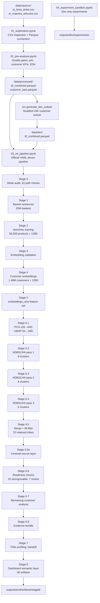

# Carrefour Data Challenge — Internal Technical Report

**Version:** Final production audit, June 2026  
**Branch:** `noise_reduction` (current working branch) | Main: `main`  
**Authors:** IE Business School Capstone Team  
**Status:** Production run complete, Stage 8 dashboard artifacts published

---

## Table of Contents

1. [Executive Summary](#1-executive-summary)
2. [Problem Statement and Motivation](#2-problem-statement-and-motivation)
3. [System Architecture Overview](#3-system-architecture-overview)
4. [Repository and File Structure](#4-repository-and-file-structure)
5. [Technologies, Libraries, and Dependencies](#5-technologies-libraries-and-dependencies)
6. [Data Inputs and Raw Data Schema](#6-data-inputs-and-raw-data-schema)
7. [Data Flow: End-to-End Pipeline](#7-data-flow-end-to-end-pipeline)
8. [Implementation Details by Stage](#8-implementation-details-by-stage)
   - [Stage 0: Environment Setup and Mode Audit](#stage-0-environment-setup-and-mode-audit)
   - [Stage 1: Basket Sentence Construction](#stage-1-basket-sentence-construction)
   - [Stage 2: Item2Vec Product Embedding Training](#stage-2-item2vec-product-embedding-training)
   - [Stage 3: Product Embedding Validation](#stage-3-product-embedding-validation)
   - [Stage 4: Customer Embedding Aggregation](#stage-4-customer-embedding-aggregation)
   - [Stage 5: Feature Set Assembly](#stage-5-feature-set-assembly)
   - [Stage 6: Dimensionality Reduction and Clustering](#stage-6-dimensionality-reduction-and-clustering)
   - [Stage 6.8: Evidence Bundle Assembly](#stage-68-evidence-bundle-assembly)
   - [Stage 7: Tribe Profiling and Handoff](#stage-7-tribe-profiling-and-handoff)
   - [Stage 8: Dashboard Semantic Layer](#stage-8-dashboard-semantic-layer)
9. [Configuration System](#9-configuration-system)
10. [Caching and Artifact Management](#10-caching-and-artifact-management)
11. [Development and Experimentation Workflow](#11-development-and-experimentation-workflow)
12. [Key Architectural and Technical Decisions](#12-key-architectural-and-technical-decisions)
13. [Production Results and Segmentation Analysis](#13-production-results-and-segmentation-analysis)
   - [13.5: Promoted Tribe Profiles](#135-promoted-tribe-profiles)
   - [13.6: Review Tribe Profiles](#136-review-tribe-profiles)
   - [13.7: Cross-Tribe Behavioral Analysis](#137-cross-tribe-behavioral-analysis)
14. [Testing Strategy](#14-testing-strategy)
15. [Development Timeline and Evolution](#15-development-timeline-and-evolution)
16. [Challenges Encountered and Solutions](#16-challenges-encountered-and-solutions)
17. [Known Limitations and Technical Debt](#17-known-limitations-and-technical-debt)
18. [Future Improvements and Recommendations](#18-future-improvements-and-recommendations)
19. [Setup Instructions and Development Workflow](#19-setup-instructions-and-development-workflow)

---

## 1. Executive Summary

Customer segmentation is a foundational instrument of retail analytics, yet conventional approaches share a common limitation: they define customers by how much or how often they shop rather than by what they choose to buy. Spend tiers compress the entire diversity of a customer's product identity into a single monetary scalar, while RFM models prioritise recency and frequency signals that are blind to category. Neither framework supports category-led commercial strategies — the kind that answers not just "who are our best customers?" but "who are our cat food customers, our gluten-free shoppers, our in-store café regulars?"

This project addresses that gap by proposing and validating a **product-first behavioral segmentation** of Carrefour Spain's customer population. The core methodological contribution is the application of Item2Vec — a skip-gram word-embedding model adapted from natural language processing — to shopping basket co-occurrence data, followed by a multi-factor weighted aggregation into customer-level representation vectors, and density-based cluster discovery via a three-pass HDBSCAN strategy. Crucially, demographic data, spend totals, and visit frequency are deliberately excluded from the modeling inputs; they enter only as post-hoc interpretation of the discovered clusters.

**Key research outcomes:** Applied to 190 million transaction lines from 1.48 million customers over six months, the pipeline discovers 22 statistically validated behavioral groups. Fifteen are promoted as final segments. They range from operationally precise identities (Gluten-Free Buyers, where 98.8% of tribe members purchase gluten-free products and top products carry 388–509× lift over the rest of the population) to rich commercial profiles (Party & Impulse Buyers, with 3.97× mean total spend and 57.2% promotional sensitivity, shopping primarily on Friday evenings). Fifty-four percent of the customer population remains as honest, unclustered noise — not force-assigned to a nearest centroid — which this report argues reflects methodological discipline rather than modelling failure.

**Scale summary:**
- 20,019,265 basket sentences for product embedding training
- 56,569 product embeddings at 128 dimensions (Item2Vec / Word2Vec skip-gram)
- 1,478,831 customer vectors at 128 dimensions, weighted by quantity, recency, and IDF
- 22 density-validated tribes from three-pass HDBSCAN with product-lift evidence gates
- 15 final promoted tribes covering 301,041 hard-assigned customers
- 7 candidate review tribes covering a further 375,800 customers
- 694,356 noise customers soft-assigned to tribes via centroid rescue (Stage 6.5a)
- 107,634 still-unassigned customers described via six remaining behavioral categories
- 58-artifact Stage 8 dashboard-ready semantic layer

The promoted tribes span a commercially meaningful range: Fresh Counter & Bakery, Personal Care, Premium Alcohol, In-Store Café, Homeware, Cat Food, On-the-Go Food & Drink, Regional Charcuterie, Gluten-Free, Alcohol (Private-Label), Family Snacking, Quick Meals, Children's Party, Party & Impulse, and Family Basics. Detailed behavioral profiles for all 22 tribes — products, sector affinities, spend distributions, shopping timing, and loyalty indicators — are presented in Section 13.

The project excludes demographic data, income, spend tiers, and revenue classifications from all modelling inputs. Those fields are permitted only as post-clustering interpretation context, a constraint enforced both in the configuration system and in the contract test suite.

---

## 2. Problem Statement and Motivation

### 2.1 Business Context

Carrefour Spain operates a large hypermarket and supermarket network. The business wanted a data-driven method to identify **distinct customer segments defined by purchase behavior** that could support targeted category management, personalized promotions, campaign design, and cross-sell strategy.

Conventional segmentation approaches often rely on spend-based tiers (high/medium/low spender) or demographic proxies. The Carrefour dataset has no demographic information, and spend-based tiers are not behaviorally specific enough to design category-led campaigns. A "high-spend" customer might be buying mostly groceries, or mostly alcohol, or mostly baby products — the same tier, but completely different marketing opportunities.

### 2.2 The Core Question

**"Which naturally occurring product-behavior groups exist in the Carrefour customer population, and what are their defining purchase signals?"**

This is an unsupervised discovery task, not a classification problem. There are no known correct tribe labels. The challenge is to design a pipeline that:
1. Learns meaningful product representations from co-purchase behavior
2. Aggregates those representations into customer-level signals
3. Finds stable, dense, commercially interpretable groups without forcing all customers into clusters
4. Provides enough evidence per group to support business interpretation and activation

### 2.3 Why Not Simpler Approaches

Several simpler approaches were considered and rejected:

| Approach | Why rejected |
|---|---|
| K-Means on spend tiers | Requires choosing K upfront; cannot handle irregular-density groups; spend is not a product-behavior signal |
| Direct product frequency vectors | Dimensionality explosion (>117K products); no shared representation for similar products |
| RFM segmentation | Recency/Frequency/Monetary captures visit patterns, not product identity |
| Demographic clustering | No demographic data available in the dataset |
| Word2Vec then 2D UMAP then K-Means | Fixed K forces customers into groups; 2D lossy for clustering |

The chosen approach — Item2Vec product embeddings → customer vector aggregation → UMAP manifold → HDBSCAN — captures genuine product-similarity relationships, handles high dimensionality, and allows the data to determine how many groups exist and how large they should be.

---

## 3. System Architecture Overview

### 3.1 High-Level Pipeline



### 3.2 Architectural Principles

**1. Product-first signal.** Customer vectors are built exclusively from product identities and purchase quantities. Income, spend, demographics, and basket value are excluded from all modeling inputs.

**2. Separation of discovery from interpretation.** Clustering (Stages 1–6) determines tribe membership. Profiling (Stage 7) and publishing (Stage 8) interpret and present results without changing assignments.

**3. Honest noise.** Customers who do not belong to a dense enough product-behavior group remain labeled as noise (`tribe_id = -1`). They are never silently forced into clusters.

**4. Evidence gates before promotion.** Every retained tribe must have at least two statistically significant product-lift signals. Tribes that pass HDBSCAN but fail lift evidence would be discarded.

**5. YAML-driven configuration.** All hyperparameters live in `configs/` files. No magic numbers exist in source code.

**6. Cache-aware pipeline.** Every expensive stage writes artifacts and records metadata fingerprints. Subsequent runs skip already-computed stages unless inputs change or `force=True` is set.

---

## 4. Repository and File Structure

### 4.1 Top-Level Layout

```text
carrefour_capstone/
├── AGENTS.md                    # Operator and modeling contract guide
├── README.md                    # Quick-start and operating conventions
├── PRESENTATION_PRD.md          # Presentation product requirements document
├── environment.yml              # Conda environment definition (source of truth)
├── pytest.ini                   # Pytest configuration
├── .env                         # Local secrets (not committed); holds GEMINI_API_KEY
├── .gitignore                   # Excludes data, outputs, models, secrets
├── configs/
│   ├── base.yaml                # Shared pipeline settings (the canonical defaults)
│   ├── dev.yaml                 # Dev-mode overrides (smaller samples, experiments enabled)
│   └── prod.yaml                # Production-scale overrides (larger samples, stricter gates)
├── data/
│   ├── raw/
│   │   ├── csv/                 # Original CSV files (not committed)
│   │   └── parquet/             # CSV-to-Parquet conversion output (not committed)
│   ├── processed/               # Notebook 02 output: df_combined, customer_kpis (not committed)
│   └── dev/                     # Stratified dev subset (not committed)
├── docs/
│   └── internal_technical_report.md  # This document
├── notebooks/
│   ├── 01_exploration.ipynb     # Raw data inspection and CSV-to-Parquet conversion
│   ├── 02_pre-analysis.ipynb    # Quality gates, join, KPIs, EDA
│   ├── 03_ml_pipeline.ipynb     # Official YAML-driven pipeline (Stages 0–8)
│   └── 04_experiment_sandbox.ipynb  # Dev-only experimentation notebook
├── outputs/                     # Generated artifacts (not committed)
│   ├── prod/
│   │   ├── .artifact_metadata.json  # Central cache manifest
│   │   ├── artifacts/
│   │   │   ├── stage1/          # Basket diagnostics
│   │   │   ├── stage2/          # Item2Vec corpus diagnostics
│   │   │   ├── stage3/          # Embedding validation reports
│   │   │   ├── stage4/          # Customer embedding diagnostics
│   │   │   ├── stage5/          # Feature set diagnostics
│   │   │   ├── stage6/          # Clustering diagnostics, evidence bundle
│   │   │   │   └── stage6_8_evidence/
│   │   │   ├── stage7/          # Tribe profiles, final handoff
│   │   │   │   └── final_handoff/
│   │   │   └── stage8/          # 58 dashboard-ready relational artifacts
│   │   ├── embeddings/          # Basket sentences, product embedding tables
│   │   ├── features/            # Customer vectors, feature sets, PCA/UMAP outputs
│   │   ├── figures/             # Visualizations
│   │   ├── models/              # Model binaries, assignment/result caches
│   │   ├── profiles/            # Tribe profile Parquets
│   │   └── reports/             # Stage markdown reports
│   └── dev/
│       └── experiments/         # Optional sandbox experiment outputs
├── src/                         # Reusable pipeline modules
└── tests/                       # Unit and regression tests
```

### 4.2 Source Module Inventory (`src/`)

| Module | Responsibility |
|---|---|
| `config.py` | Configuration loading, deep YAML merge, mode resolution, `PipelineConfig` dataclass with all path properties |
| `data_loader.py` | CSV-to-Parquet conversion, checksum verification, lazy Parquet loading, prepared-transaction loading |
| `data_quality.py` | Quality report building and caching from Notebook 02 outputs |
| `basket_builder.py` | Stage 1: basket sentence construction, common-product diagnostics, downsampling plan |
| `item2vec.py` | Stage 2: Word2Vec/Item2Vec training, model persistence, corpus summary diagnostics |
| `embeddings.py` | Helpers for embedding matrix loading and manipulation |
| `embedding_validation.py` | Stage 3: nearest-neighbor sampling, hubness diagnostics, product-category validation, guardrail checks |
| `customer_embeddings.py` | Stage 4: weighted product-embedding aggregation to customer vectors, IDF weighting, recency decay, frequency weighting, normalization, coverage gates |
| `feature_engineering.py` | Stage 5: behavioral KPI features and product-exposure feature construction |
| `dimensionality.py` | Stage 6.1: PCA pre-reduction and UMAP representation building (batch-transform support for large populations) |
| `dimensionality_experiments.py` | Dev-only: broader UMAP/PCA sweep experiments |
| `clustering.py` | Stage 6: GMM, HDBSCAN, PCA-KMeans model runners; soft-assignment helpers |
| `cluster_validation.py` | Three-stage HDBSCAN orchestration, lift-filter logic, centroid-rescue layer |
| `evaluation.py` | Silhouette, Davies-Bouldin, DBCV, cluster size CV, and quality gate evaluation |
| `model_selection.py` | Grid-search coordination across model families |
| `profiling.py` | Stage 7: tribe profiling, product/sector/theme lift computation, remaining-customer analysis, LLM synthesis integration, Stage 7 delivery readiness checks |
| `organic_profiler.py` | Co-purchase mission analysis, loyalty profile, temporal pattern helpers, LLM synthesis backends |
| `llm_analysis.py` | Optional Gemini-based post-profiling interpretation (does not affect clustering or promotion) |
| `tribe_namer.py` | Evidence-based tribe naming helpers, theme label dictionary |
| `product_themes.py` | Strategic product theme detection via keyword patterns |
| `product_filtering.py` | Product filtering utilities for profiling context |
| `stage8.py` | Stage 8: dashboard-ready semantic layer, 58-artifact output schema, relational integrity checks |
| `stage_reports.py` | Compact markdown stage-report generation |
| `exports.py` | Cluster summary CSV, tribe comparison, atlas HTML, profile evidence reports |
| `visualization.py` | UMAP and cluster visualization helpers |
| `autoencoder.py` | Experimental PyTorch autoencoder for latent dimensionality reduction (not used in official pipeline) |
| `experiment_sandbox.py` | Dev experiment orchestration helpers |
| `experiment_reporting.py` | Experiment result formatting and export |
| `generate_dev_subset.py` | Stratified dev-subset generation from full production data |
| `cache_audit.py` | Artifact cache inspection utilities |
| `progress.py` | Structured event logging and stage timing |
| `utils.py` | Shared helpers: cache checking, metadata hashing, file fingerprinting, NumPy matrix extraction, deterministic sampling |
| `customer_vectors.py` | Additional customer vector construction utilities |
| `build_customer_atlas.py` | Customer atlas construction for Stage 8 |
| `mission_microtribes.py` | Mission-level micro-tribe analysis helpers |

### 4.3 Test Inventory (`tests/`)

| Test file | What it protects |
|---|---|
| `test_config_overrides.py` | Config folder integrity, mode override correctness, official Stage 6 YAML contract |
| `test_cache_policy.py` | Cache metadata behavior, force-flag semantics |
| `test_basket_staple_diagnostics.py` | Common-product identification logic |
| `test_item2vec_corpus.py` | Basket corpus size and token counts |
| `test_embedding_validation.py` | Guardrail check logic for product embeddings |
| `test_customer_embeddings.py` | Customer vector construction and gate logic |
| `test_feature_set_diagnostics.py` | Feature set column integrity |
| `test_dimensionality_pca.py` | PCA variance retention |
| `test_model_selection_official_umap.py` | Official UMAP-HDBSCAN model selection contract |
| `test_two_stage_hdbscan_lift_filter.py` | Two-stage and three-stage HDBSCAN lift-filter logic |
| `test_cluster_validation.py` | Cluster readiness and jitter stability |
| `test_stage6_subsection_diagnostics.py` | Stage 6 quality evidence outputs |
| `test_product_exposure_features.py` | Product-exposure feature construction |
| `test_product_themes.py` | Product theme detection accuracy |
| `test_profiling_readiness.py` | Stage 7 delivery readiness checks |
| `test_tribe_namer.py` | Tribe naming helpers |
| `test_llm_analysis.py` | LLM analysis module (offline/mock) |
| `test_stage_reports.py` | Stage report generation |
| `test_stage8_exports.py` | Stage 8 artifact schema and relational integrity |
| `test_stage9_exports.py` | Extended Stage 8/9 export contracts |

---

## 5. Technologies, Libraries, and Dependencies

### 5.1 Complete Dependency List

| Library | Version | Purpose | Why this choice |
|---|---|---|---|
| **Python** | 3.11.15 | Runtime | Stable LTS with full typing support; matches team environment |
| **Polars** | 1.40.1 | Data manipulation | Lazy evaluation and streaming enable processing 190M rows on a single machine; significantly faster than Pandas for columnar operations; Rust-backed for memory efficiency |
| **Gensim** | 4.4.0 | Item2Vec / Word2Vec | Battle-tested NLP library with efficient Word2Vec implementation; corpus streaming avoids loading all baskets into memory simultaneously |
| **umap-learn** | 0.5.12 | Dimensionality reduction | Preserves local neighborhood structure better than PCA alone; supports cosine metric; batch-transform for large populations |
| **hdbscan** | 0.8.40 | Density-based clustering | No fixed K; handles irregular cluster shapes; explicit noise label; supports `approximate_predict` for large populations |
| **scikit-learn** | 1.7.2 | ML utilities (StandardScaler, PCA, MiniBatchKMeans, evaluation metrics) | **Pinned to 1.7.2**: hdbscan 0.8.40 calls `force_all_finite` which was removed in sklearn 1.8; must not be upgraded without first upgrading hdbscan |
| **NumPy** | 1.26.4 | Numerical computation | Core array operations for embedding matrices |
| **PyArrow** | 24.0.0 | Parquet I/O backend | Required by Polars for Parquet read/write |
| **PyTorch** | 2.12.0 | Autoencoder experiments (dev only) | Used in experimental autoencoder path; not part of official pipeline |
| **Pandas** | 3.0.3 | Dev subset generation only | Used in `generate_dev_subset.py` for KS test compatibility with SciPy |
| **SciPy** | 1.17.1 | KS tests for dev subset validation | Validates that dev subset preserves population distributions |
| **Matplotlib** | 3.10.9 | Static visualizations | Standard Python plotting for pipeline figures |
| **Seaborn** | 0.13.2 | Statistical visualizations | Heatmaps and distribution plots for tribe profiling figures |
| **Plotly** | 5.22.0 | Interactive visualizations | Cluster scatter plots and interactive tribe comparisons |
| **Dash** | >=2.17,<3 | Dashboard app framework | Serves Stage 8 interactive demo application |
| **PyYAML** | 6.0.3 | Configuration parsing | Reads `configs/*.yaml` files |
| **python-dotenv** | 1.2.2 | Secret management | Loads `GEMINI_API_KEY` from `.env` file for optional LLM analysis |
| **pytest** | 9.0.3 | Testing framework | All tests run via `pytest tests/` |

### 5.2 Key Dependency Constraint

The HDBSCAN/scikit-learn version pin is the most critical dependency constraint in this project. `hdbscan==0.8.40` calls `sklearn.utils.validation.force_all_finite`, which was **removed in sklearn 1.8**. If the conda environment is updated without pinning sklearn, the HDBSCAN production run will fail with a cryptic `TypeError`.

The `environment.yml` comment on the scikit-learn line documents this constraint explicitly:

```yaml
- scikit-learn=1.7.2    # hdbscan 0.8.40 still calls force_all_finite, removed in sklearn 1.8
```

Verify the environment is correct with:

```powershell
python -c "import sklearn, hdbscan; print(sklearn.__version__); print('hdbscan ok')"
```

Expected output: `1.7.2` then `hdbscan ok`.

### 5.3 Why Polars Was Chosen Over Pandas

The full transaction dataset is approximately 190 million rows. Pandas' default behavior loads the entire DataFrame into RAM. The team encountered out-of-memory crashes in early development using Pandas-based EDA code (see Section 16.1).

Polars solves this in two ways:
- **LazyFrame API**: queries are built as expression trees and evaluated only when `.collect()` is called, allowing Polars to push filters down before materialization.
- **Streaming collect**: `collect_streaming()` (wrapping Polars' streaming engine) processes data in chunks without materializing the full result set at once.

The codebase uses `pl.scan_parquet()` (lazy) rather than `pl.read_parquet()` (eager) wherever the full table is not needed in memory. Eager reads are used only when the resulting frame must fit in RAM (e.g., feeding a NumPy matrix to sklearn).

---

## 6. Data Inputs and Raw Data Schema

### 6.1 Raw CSV Files

Both files are **semicolon-delimited** (`separator=";"`) and **Latin-1 encoded** (`encoding="latin1"`). They must be placed in `data/raw/csv/` before running Notebook 01.

**`ie_linea_ticket.csv` — Ticket line transactions**

| Column | Type | Description |
|---|---|---|
| `idempres` | int | Company/store identifier |
| `fecha` | date | Transaction date (format: YYYY-MM-DD) |
| `hora` | time | Transaction time |
| `ticket` | str/int | Unique ticket/basket identifier |
| `cliente` | int | Customer identifier (anonymized) |
| `idarticu` | int | Article/product identifier |
| `unidades` | float | Units purchased (can be negative for returns) |
| `importe` | float | Line value in currency units (can be negative for returns) |
| `idpromoc` | str | Promotion identifier (nullable) |
| `idtiprod` | str | Product type code (nullable) |

**`ie_maestra_articulos.csv` — Product master / article catalogue**

| Column | Type | Description |
|---|---|---|
| `idarticu` | int | Article identifier (joins to `linea_tickets.idarticu`) |
| `desc_larga_articulo` | str | Long product description |
| `idsector` | int | Sector/category identifier |
| `desc_sector` | str | Sector description |

### 6.2 Data Quality Facts (Confirmed from `quality_report.json`)

| Metric | Value |
|---|---|
| Raw ticket rows audited | 191,017,715 |
| Rows dropped (cleaning rule) | 655,196 |
| Rows retained after cleaning | 190,362,519 |
| Cleaning rule | Drop rows where `unidades <= 0` OR `importe <= 0` |
| Unique customers in quality report | 1,482,715 |
| Eligible customers (≥3 tickets) | 1,086,761 |
| Unique products in tickets | 117,701 |
| Product-master coverage | 100.0% |
| Date range | January 2022 – June 2022 (6 months) |

**Important distinction:** The 3-ticket eligibility threshold applies to the `customer_kpis` profiling table. The official production customer embedding matrix contains **1,478,831 embedded customers** after the full pipeline runs — this is not the same as the 1,086,761 three-ticket-eligible subset. The difference reflects customers who appear in the prepared transaction data even with few tickets but who still contribute product-embedding signal.

### 6.3 Sector Classification

The product master uses six sector codes that the codebase maps to broader behavioral bins for dev-subset stratification:

| Sector ID | Sector description | Behavioral bin |
|---|---|---|
| 1 | Packaged / dry grocery (PGC) | `grocery_pgc` |
| 2 | Fresh / perishables | `fresh` |
| 3 | BAZAR — general merchandise | `non_food` |
| 4 | ELECTROFOTO — electronics/photo | `non_food` |
| 6 | TEXTIL — clothing/textiles | `non_food` |
| 7 | GASOLINERA — fuel/convenience | `non_food` |

---

## 7. Data Flow: End-to-End Pipeline

The full data flow from raw CSV files to Stage 8 dashboard artifacts passes through seven distinct transformation layers:

```
Raw CSV (191M rows, semicolon-delimited, latin1)
  │  [data_loader.convert_csv_to_parquet]
  ▼
Raw Parquet (data/raw/parquet/)
  │  [Notebook 02: join, clean, KPIs, EDA]
  ▼
Prepared Parquet (data/processed/df_combined.parquet)
  │  [src.generate_dev_subset — optional]
  ├─► Dev subset (data/dev/df_combined.parquet, 44K customers, 7.5M rows)
  │
  │  [Stage 1: basket_builder.build_basket_sentences]
  ▼
Basket sentences (outputs/prod/embeddings/basket_sentences.parquet)
  20,019,265 rows, each containing a list of product tokens
  │
  │  [Stage 2: item2vec.train_item2vec + save_product_embeddings]
  ▼
Product embeddings (outputs/prod/embeddings/product_embeddings.parquet)
  56,569 products × 129 columns (idarticu + emb_000…emb_127)
  │
  │  [Stage 4: customer_embeddings.build_customer_embeddings]
  ▼
Customer embeddings (outputs/prod/features/customer_embeddings.parquet)
  1,478,831 customers × 129 columns (cliente + emb_000…emb_127)
  │
  │  [Stage 5: feature_engineering]
  ▼
Feature set (outputs/prod/features/feature_set_embeddings_only.parquet)
  1,478,831 customers × 129 columns (same as customer embeddings for embeddings_only)
  │
  │  [Stage 6.1: dimensionality.build_pca_representation]
  ▼
PCA 64D (outputs/prod/features/feature_set_pca.parquet)
  1,478,831 customers × 65 columns (cliente + pca_000…pca_063)
  │
  │  [Stage 6.1: dimensionality.build_umap_representation]
  ▼
UMAP 20D (outputs/prod/features/feature_set_umap_pca64_u20_n75.parquet)
  1,478,831 customers × 21 columns (cliente + umap_000…umap_019)
  │
  │  [Stages 6.2–6.5: cluster_validation.run_three_stage_hdbscan]
  ▼
Hard cluster assignments (outputs/prod/models/model_selection/cluster_assignments_*.parquet)
  1,478,831 customers × tribe_id + confidence + source columns
  │
  │  [Stage 6.5a: centroid rescue activation layer]
  ▼
Rescue-augmented assignments (for activation lookup only, not profiling)
  │
  │  [Stage 6.8: profiling.run_stage68]
  ▼
Evidence bundle (outputs/prod/artifacts/stage6/stage6_8_evidence/)
  22 tribe evidence rows, 430,466 product-lift rows, 110 sector-lift rows
  │
  │  [Stage 7: profiling.profile_tribes]
  ▼
Tribe profiles (outputs/prod/artifacts/stage7/final_handoff/)
  15 promoted tribes, 7 review tribes, tribe cards, playbooks
  │
  │  [Stage 8: stage8.build_stage8_artifacts]
  ▼
Dashboard semantic layer (outputs/prod/artifacts/stage8/)
  58 relational Parquet/JSON files
```

---

## 8. Implementation Details by Stage

The pipeline implements a **three-layer representation learning architecture** for behavioral customer segmentation. The central methodological challenge is that raw transaction data — a table of (customer, product, quantity, date) tuples — cannot be directly clustered in a meaningful way. Products must first be placed in a shared semantic space where proximity reflects co-purchase affinity; customers must then be projected into that same space as weighted composites of their purchased product embeddings; and the resulting high-dimensional manifold must be compressed and explored to surface natural density concentrations.

This progression — (1) product representation learning via Item2Vec, (2) customer vector construction via weighted aggregation, (3) manifold-based discovery via UMAP and HDBSCAN — satisfies three properties simultaneously: it is **product-first** (clustering signal derives entirely from what customers buy, not how much or how often), it is **non-parametric** (the number of tribes is not specified in advance), and it is **evidence-gated** (each candidate tribe must demonstrate at least two statistically significant product-lift signals before promotion, providing a commercially interpretable account of every cluster). Each stage below is described not only in terms of what it computes, but why that computation is the appropriate step given the constraints of the preceding and following stages.

### Stage 0: Environment Setup and Mode Audit

**Purpose:** Establish the active run mode, verify directory structure, load configuration, and confirm all required data paths are accessible before running any expensive computation.

**Implementation:** The first cell in `03_ml_pipeline.ipynb` calls `src.config.configure_mode(RUN_MODE)`, where `RUN_MODE` is set explicitly in the notebook. This updates all module-level path globals (`DATA_PROCESSED`, `MODELS`, `OUTPUTS`, etc.) for the rest of the kernel session.

Stage 0 runs 33 mode/path checks covering: required data files exist, output directories are writable, config keys are valid, and mode-specific settings are consistent. In production, all 33 checks pass.

**Important note:** The `CARREFOUR_MODE` environment variable (or the notebook `RUN_MODE` cell) is the authoritative mode selector. Unset means `prod`. The `configure_mode()` function also sets the environment variable so that child processes inherit the mode.

---

### Stage 1: Basket Sentence Construction

**Source module:** `src/basket_builder.py`

**Purpose:** Convert the cleaned transaction table into a list of "sentences," one per shopping basket (ticket), where each sentence is a list of product-ID tokens. These sentences are the training corpus for Item2Vec.

**Construction strategy:** The production run uses `construction_strategy: common_downsampled`.

**Step 1 — Common-product diagnostics:**  
Before building baskets, `build_basket_staple_diagnostics()` scans the full transaction table to identify products that appear in more than 1% of customers (`customer_penetration >= 0.01`), more than 0.5% of baskets (`basket_penetration >= 0.005`), or more than 0.5% of transaction lines (`line_share >= 0.005`). These are "common-product candidates" — staples like bread, milk, and eggs that appear in so many baskets that their co-occurrence with other products carries little discriminative signal about customer behavior.

In production: 1,429 common-product candidates were identified, 1 was auto-excluded (exceeds both the 50% customer penetration and 10% basket penetration thresholds simultaneously), and 1,428 were flagged for probabilistic downsampling.

**Commonness score formula:**
```
commonness_score = 0.45 × customer_penetration + 0.45 × basket_penetration + 0.10 × line_share
```

**Step 2 — Downsampling plan:**  
For each common-product candidate, `_common_product_keep_plan()` computes a keep probability:

```python
base_ratio = target_penetration / current_customer_penetration
keep_probability = max(base_ratio ** exponent, min_keep_probability)
```

With `target_customer_penetration=0.01`, `keep_probability_exponent=0.5`, and `min_keep_probability=0.15`, products are kept at reduced probability proportional to how far above the target penetration they sit. The square-root exponent (0.5) makes the downsampling gentler: a product with 10× the target penetration gets ~31% keep probability, not 10%.

**Step 3 — Deterministic basket construction:**  
Each (ticket, product) pair is assigned to keep or drop using a deterministic hash:
```python
sample_value = hash(ticket + "|" + product) % 1_000_000 / 1_000_000
keep = sample_value < keep_probability
```
This is deterministic given the random seed — the same basket always produces the same downsampled sentence. A fallback ensures that if all products in a basket would be dropped, at least the highest-keep-probability product is retained (preventing empty baskets).

**Step 4 — Token ordering:**  
Within each basket, product tokens are sorted by a deterministic hash of `ticket|product`. This prevents any artifact from the original row order in the source data from leaking into the Word2Vec co-occurrence window.

**Production output:** 20,019,265 basket sentences, 99.963% basket retention after downsampling.

**Why `repeat_product_by_quantity: false`:**  
The `unidades` column is deliberately excluded from basket sentence construction. Quantities enter the pipeline later in Stage 4's weighted customer-embedding aggregation, where they are treated as a continuous weighting factor rather than token repetition. Repeating product tokens by quantity in the basket would conflate bulk purchases with distinct co-purchase evidence.

---

### Stage 2: Item2Vec Product Embedding Training

**Source module:** `src/item2vec.py`

**Purpose:** Learn a 128-dimensional dense vector for each product such that products frequently purchased together in the same basket have similar vectors.

**Algorithm:** Word2Vec Skip-gram applied to the basket corpus, treating each basket as a "sentence" and each product ID as a "word." This application is known as Item2Vec (Barkan & Koenigstein, 2016).

**Training configuration (production):**

| Parameter | Value | Meaning |
|---|---|---|
| `vector_size` | 128 | Each product embedded in 128 dimensions |
| `window` | 2 (configured) | Local co-occurrence window |
| `full_basket_context` | true | Override: window is extended to cover the full basket |
| Effective window | 20 | Max basket length after `max_tokens_per_basket=20` |
| `min_count` | 60 | Products appearing in fewer than 60 baskets are excluded from embedding |
| `negative` | 10 | Negative samples per positive context pair (noise-contrastive estimation) |
| `sample` | 0.0001 | Subsampling threshold to reduce influence of very frequent products |
| `epochs` | 5 | Training passes over the corpus |
| `sg` | 1 | Skip-gram (predicts context from target) rather than CBOW |
| `workers` | 5 (prod) | Parallel training threads |
| `seed` | 42 | Deterministic initialization |

**Full-basket context:** When `full_basket_context=true`, Gensim's `window` parameter is set to the maximum basket length (20 tokens after capping). This means every product in a basket can directly influence every other product's embedding, not just neighbors within a narrow window. This is important for small baskets (3–5 products) where a narrow window would artificially exclude many valid co-purchase signals.

**Product exclusion:** Products with fewer than 60 appearances across all baskets are excluded from the vocabulary (`min_count=60`). These products have insufficient co-occurrence evidence for meaningful embedding. In production, this exclusion reduces the embedded vocabulary from 117,701 total products to 56,569 embedded products. The 61,132 excluded products still contribute to the basket corpus but receive no embedding vector.

**Output format:** Product embeddings are saved as a Parquet file with columns `idarticu, emb_000, emb_001, ..., emb_127` (one row per embedded product, sorted by `idarticu`).

**Why skip-gram over CBOW:** Skip-gram performs better than CBOW for rare products because it generates more training examples per product appearance. Given that many products are niche (few baskets), skip-gram is the more appropriate architecture.

---

### Stage 3: Product Embedding Validation

**Source module:** `src/embedding_validation.py`

**Purpose:** Validate that the learned product embeddings capture meaningful semantic relationships — that products bought together are close in embedding space, and that the embeddings do not show pathological patterns like hub dominance or cross-category confusion.

**Validation checks:**
1. **Nearest-neighbor sampling:** Sample 100 products, retrieve their 8 nearest neighbors, and check whether neighbors are semantically plausible (similar product description, same sector).
2. **Niche/common/rare product checks:** Sample products from different popularity tiers and confirm that their neighbors are coherent within their tier.
3. **Hubness diagnostics:** Measure how often each product appears as a nearest neighbor of other products. A "hub" product appears in many other products' neighbor lists, which can indicate that common-product downsampling was insufficient.
4. **Cross-sector guardrails:** Check that hubs are not predominantly cross-sector (a product in TEXTIL should not be the top neighbor of products in ALIMENTACIÓN).

**Production result:** `action_needed`  
The production run flagged 2 guardrail issues related to high-inbound cross-sector hubs. This means some products (likely staples that survived downsampling) appear as nearest neighbors of products from unrelated sectors. This is a known limitation and a reason why the product-lift evidence gates in Stage 6.5 are important: they prevent mathematically dense but commercially vague clusters from being promoted as final tribes.

**Guardrail thresholds (from `base.yaml`):**

| Guardrail | Threshold | Meaning |
|---|---|---|
| `max_generic_warning_product_share` | 10% | Max share of sampled products with generic neighbors |
| `min_rare_same_sector_share` | 35% | Rare products should have ≥35% same-sector neighbors |
| `max_top_hub_cross_sector_share` | 80% | Top hubs must not be >80% cross-sector |
| `max_hubness_lift` | 10× | Max hubness relative to expected frequency |

---

### Stage 4: Customer Embedding Aggregation

**Source module:** `src/customer_embeddings.py`

**Purpose:** Collapse all of a customer's product-embedding vectors into a single 128-dimensional customer vector that represents their purchase identity.

**Weighting scheme:** The official recipe is `weight_strategy: quantity_idf`.

For each (customer, product) pair across all transactions, a composite weight is computed:

```
final_weight = base_weight × recency_multiplier × frequency_multiplier × idf_weight
```

**1. Base weight (`log1p(unidades)`):**  
```python
base_weight = log(positive_units + 1.0)
```
`unidades` is the number of units purchased. `log1p` compresses the scale so that buying 10 units of a product does not completely dominate buying 1 unit of another product, while still encoding the quantity signal.

**2. Recency multiplier (exponential decay):**  
```python
days_ago = reference_date - transaction_date
decay = exp(-log(2) × days_ago / half_life_days)
recency_multiplier = max(decay, min_multiplier)
```
With `half_life_days=180` and `reference_date=2022-06-30` (last day of the dataset), a transaction from January 2022 (~180 days before June 30) receives a multiplier of ~0.5. A transaction from June 2022 receives ~1.0. The `min_multiplier=0.35` prevents very old transactions from being zeroed out entirely.

Production diagnostics: mean recency multiplier = 0.7223 (customers on average have moderately recent purchase history).

**3. Frequency multiplier (product basket count):**  
```python
basket_count = number of distinct tickets this customer bought this product
frequency_multiplier = min((log2(basket_count + 1)) ^ 0.5, 2.0)
```
With `transform=log1p`, `exponent=0.5`, and `max_multiplier=2.0`, a customer who buys the same product in 10 baskets gets a frequency multiplier of approximately 1.2×. This rewards loyal product relationships without letting extremely loyal products completely dominate. The maximum multiplier of 2.0 caps extreme cases.

Production diagnostics: mean frequency multiplier = 1.087.

**4. IDF weight (product rarity):**  
```python
idf_weight = log((total_customers + 1) / (product_customer_count + 1)) + 1.0
```
Products bought by many customers receive lower IDF (they are common signals). Products bought by few customers receive higher IDF (they are distinctive signals). This is the same TF-IDF principle from information retrieval applied to purchase behavior.

**5. Weighted average aggregation:**  
```python
customer_vector = sum(weight × product_embedding) / sum(weight)
```
The customer's vector is the weighted sum of all their product embedding vectors, normalized by total weight, then L2-normalized to unit length.

**Partitioned computation:** To avoid loading all 190M transaction rows and all customer-product weights into RAM simultaneously, customer embedding computation is partitioned by customer-ID range (numeric clients) or hash bucket (string clients). Partitions are written to temporary Parquet files and concatenated at the end.

**Coverage gates (confirmed passing):**

| Gate | Threshold | Production value | Status |
|---|---|---|---|
| Line coverage | ≥85% | 97.316% | PASS |
| Unit coverage | ≥85% | 97.711% | PASS |
| Customer coverage | ≥99% | 99.738% | PASS |
| Zero-embedded customers | ≤1% | 0.262% | PASS |
| Top product weight share | ≤5% | <5% | PASS |

The ~3% line/unit gap between raw transactions and embedded coverage is explained by products below the `min_count=60` Item2Vec threshold, which have no embedding vector and therefore cannot contribute to customer vectors.

---

### Stage 5: Feature Set Assembly

**Source module:** `src/feature_engineering.py`

**Purpose:** Prepare the final feature matrix that will be passed to the clustering algorithms. In production, this is a pass-through of the customer embedding vectors.

**Official configuration:** `modeling.feature_set_for_selection: embeddings_only`

The `embeddings_only` feature set is identical to the customer embedding output from Stage 4. No behavioral (spend, recency, frequency) or product-exposure features are added to the official clustering inputs.

**Why embeddings-only:** The product-first contract specifies that clustering signal must come from product identity, not from spend magnitude or visit frequency. Behavioral features are computed separately and are available for post-clustering profiling and interpretation only.

**Disabled in production:**
- `product_exposure_features.enabled: false` — pre-computed product-sector/theme/family exposure features are built as challenger evidence but not used in the official clustering run.
- `modeling.feature_set_for_selection: embeddings_only` — explicitly prohibits alternate feature sets from entering the official model selection.

**Challenger feature sets (available but not used in production):**
- `embeddings_frequency`: embeddings + behavioral frequency anchor
- `embeddings_product_exposure`: embeddings + product-sector/theme exposure features
- `embeddings_behavior`: embeddings + spend/visit behavioral KPIs

---

### Stage 6: Dimensionality Reduction and Clustering

**Source modules:** `src/dimensionality.py`, `src/clustering.py`, `src/cluster_validation.py`, `src/evaluation.py`

This is the core unsupervised learning stage of the project. It has eight sub-stages (6.1 through 6.8).

#### Stage 6.1: PCA and UMAP Representation

**PCA pre-reduction:**

```
Input: 1,478,831 customers × 128D customer embeddings
Step 1: StandardScaler (zero mean, unit variance per dimension)
Step 2: PCA (128 → 64 components)
Output: 1,478,831 × 64D PCA representation
```

Production result: 64 PCA components retain **86.858%** of total variance. PCA is applied before UMAP to:
1. Remove noise dimensions (the bottom 14% of variance is mostly noise)
2. Reduce the cost of building the UMAP neighbor graph (UMAP cost scales with input dimension)
3. Improve UMAP stability on cosine-metric data

**UMAP representation:**

```
Input: 1,478,831 × 64D PCA representation
Settings: n_components=20, n_neighbors=75, min_dist=0.0, metric=cosine
Fit: on deterministic 300,000-customer sample
Transform: full population in 50,000-customer batches
Output: 1,478,831 × 20D UMAP representation
```

**Why n_components=20 and not 2:** Two-dimensional UMAP is excellent for visualization but discards too much structure for clustering. Using 20 dimensions preserves significantly more local neighborhood information. The final 2D visualization in Stage 8 is produced separately for display purposes only and does not affect clustering.

**Why n_neighbors=75:** Larger neighborhood sizes produce smoother, more global manifolds. At 75 neighbors, the UMAP manifold captures both tight local product-behavior clusters and the broader global structure of the customer population.

**Why min_dist=0.0:** This allows UMAP to pack nearby points as tightly as possible. For clustering (as opposed to visualization), tight packing creates clearer density peaks for HDBSCAN to detect.

**Why cosine metric:** Customer embedding vectors are L2-normalized to unit length. For unit vectors, cosine similarity equals the dot product and is the natural distance measure for comparing directional signals in embedding space. Euclidean distance on unit vectors is equivalent to cosine distance up to a monotone transform, but cosine is more numerically stable here.

**UMAP quality diagnostics (production):**

| Metric | Value | Interpretation |
|---|---|---|
| Trustworthiness | 0.9044 | Good — local neighbors in UMAP mostly correspond to true neighbors in original space |
| Mean kNN overlap | 20.36% | Moderate — 20% of 20 nearest neighbors in UMAP were also in original top-20 |
| Distance Spearman correlation | 0.4517 | Weak global distance preservation — UMAP compresses large-scale geometry |
| UMAP check status | pass | |

The weak Spearman correlation is expected: UMAP intentionally sacrifices global distance preservation to improve local structure. Downstream analyses should compare within-cluster distances, not use UMAP distances to infer global population structure.

#### Stages 6.2–6.4: Three-Pass HDBSCAN

**Why three passes instead of one:**  
A single HDBSCAN pass with a fixed minimum cluster size either:
- Uses a large `min_cluster_size` → finds major behavioral groups but leaves many smaller pockets undetected
- Uses a small `min_cluster_size` → finds small clusters but over-fragments large ones and creates many spurious groups

The three-pass strategy solves this by applying HDBSCAN iteratively, each time with slightly relaxed parameters, to the noise left by the previous pass:

```
Pass 1 (6.2): Full population of 1,478,831 customers
  min_cluster_size=3500, min_samples=8, leaf
  → 8 clusters, 410,399 assigned, 1,068,432 noise

Pass 2 (6.3): First-pass noise only (1,068,432 customers)
  min_cluster_size=3000, min_samples=6, leaf
  → 8 additional clusters, 205,510 assigned, 862,922 still noise

Pass 3 (6.4): Second-pass noise only (862,922 customers)
  min_cluster_size=2000, min_samples=6, leaf
  → 6 additional clusters, 60,932 assigned, 801,990 final noise

Merge (6.5): All 22 clusters from three passes
  Product-lift filter: ≥2 strong significant product lifts required
  → 22 clusters retained, 0 rejected
```

**`cluster_selection_method: leaf`:** HDBSCAN supports two cluster selection methods:
- `eom` (Excess of Mass): selects broad, stable clusters — tends to find fewer, larger groups
- `leaf`: selects the finest-grained stable clusters — finds more granular, specific groups

`leaf` was chosen after experimentation because it better recovers the distinctive product-behavior pockets (e.g., gluten-free buyers, regional charcuterie enthusiasts) that would be absorbed into larger, less interpretable clusters under `eom`.

**Hard assignments only:** The official pipeline never soft-assigns noise points. A customer with `tribe_id = -1` is genuinely noise — their purchase behavior does not strongly align with any single tribe. This design choice preserves analytical honesty and prevents inflated coverage claims.

#### Stage 6.5: Three-Pass Merge and Lift Filter

After the three passes, all cluster assignments are merged. Clusters from different passes receive globally unique tribe IDs (0, 1, 2, ... 21).

**Product-lift filter:** For each of the 22 clusters, the top product lifts are computed:

```
lift = (product_purchase_rate_within_tribe) / (product_purchase_rate_in_remaining_customers)
```

A "strong significant lift" requires:
- `lift > 1.5`
- Statistically significant (FDR-corrected q-value < 0.05)

Clusters must have at least 2 strong significant product lifts to be retained. In production, all 22 clusters passed this gate (0 rejected). This confirms that every HDBSCAN-identified group corresponds to a genuinely distinctive product-purchase pattern.

#### Stage 6.5a: Centroid Rescue Activation Layer

After the core hard assignment, a separate "activation layer" is computed for messaging and dashboard lookup purposes. Noise customers are assigned to their nearest tribe centroid if their centroid distance falls within the 75th-percentile distance of existing hard-core customers (`noise_rescue: strategy: q75`). In production, this rescues **694,356** of the 801,990 HDBSCAN noise customers, reducing the truly unassigned population to **107,634** (post-rescue noise rate: 7.28%). Those 107,634 remaining customers are subsequently analyzed by Stage 6.7.

**Critical constraint:** The centroid-rescue assignment is **separate from the core profiling assignment**. It does NOT change which customers are used to compute product lifts, sector lifts, or tribe profiles. It exists only to increase the coverage available for downstream messaging activation (e.g., "how many customers can I email about Cat Food?"). Stage 6.8 and Stage 7 consume the core-only assignment for all profiling and evidence work.

#### Stage 6.6: Readiness Assessment

For each of the 22 clusters, Stage 6.6 runs jitter-based stability tests and assigns a readiness label:

**Jitter test procedure:**
1. Sample 10,000 hard-assigned customers
2. Add small Gaussian noise to their customer embedding vectors (σ = 0.02 × feature scale)
3. Assign perturbed vectors to the nearest original tribe centroid
4. Measure label recovery rate: what fraction of customers are assigned to their original tribe after perturbation?

**Readiness labels** (gating metric: `jitter_label_recovery_accuracy`):
- `strong`: No blockers AND jitter label recovery ≥ 0.80
- `usable`: No blockers AND jitter label recovery in [0.60, 0.80)
- `review`: One or more blockers — jitter label recovery < 0.60, low assignment confidence, or undersized cluster

**Production readiness summary:**

| Metric | Value |
|---|---|
| DBCV | -0.1715 (weak density-validity) |
| Core-only silhouette | 0.0996 (weak separation) |
| Jitter ARI mean | 0.3806 |
| Jitter label recovery mean | 0.5740 |
| Clusters marked `strong` or `usable` | 15 |
| Clusters marked `review` | 7 |
| Average assignment confidence | 0.9264 |
| Cluster size CV | 0.8654 (passed balance gate) |

The weak DBCV and silhouette scores are expected in density-based clustering of high-dimensional behavioral data. These metrics assume convex, well-separated clusters and penalize the irregular shapes that HDBSCAN specifically targets. The business decision to promote 15 tribes as final and hold 7 as review is grounded in product-lift evidence and jitter recovery, not classical cluster-quality metrics alone.

#### Stage 6.7: Remaining Customer Analysis

The 801,990 HDBSCAN noise customers do not all reach Stage 6.7. Stage 6.5a centroid rescue runs first and absorbs **694,356** of them into soft tribe assignments, reducing the unassigned population to **107,634** (7.3% of all embedded customers). Stage 6.7 runs its affinity analysis on this residual group only — the customers who remain outside any tribe even after the relaxed centroid rescue.

For each of the 107,634 still-unassigned customers, Stage 6.7 measures their proximity to tribe centroids and assigns a descriptive business category:

| Remaining segment | Customers | Share of remaining | Population share | Interpretation |
|---|---:|---:|---:|---|
| Bridge customers | 45,539 | 42.3% | 3.08% | Affinity split across ≥2 tribes; not appropriate for exclusive tribe targeting |
| Near-tribe fringe customers | 22,393 | 20.8% | 1.51% | Close to one tribe but outside the dense core; candidate for soft-audience targeting |
| Sparse / low-signal shoppers | 15,500 | 14.4% | 1.05% | Too few transactions for stable cluster membership |
| Broad generalist shoppers | 12,529 | 11.6% | 0.85% | Wide basket behavior dilutes product-lift and density signals |
| Unclear long-tail customers | 7,052 | 6.6% | 0.48% | Heterogeneous behavior not explained by any tribe structure |
| High-value broad-basket customers | 4,621 | 4.3% | 0.31% | High spend but product mix too broad for single-tribe targeting |
| **Total remaining** | **107,634** | **100%** | **7.28%** | |

These six remaining-customer segments are **descriptive business categories**, not additional hard tribes. They are presented in Stage 7 and Stage 8 as strategy recommendations rather than cluster outputs.

---

### Stage 6.8: Evidence Bundle Assembly

**Source module:** `src/profiling.py` (function `run_stage68`)

**Purpose:** Precompute all evidence that Stage 7 will need — without reopening the full 190M-row transaction table again. Stage 6.8 is the "raw-evidence boundary."

**What Stage 6.8 computes:**
- Per-tribe product lift tables (lift vs. rest, significance, customer counts): 430,466 rows
- Per-tribe sector lift tables (sector purchase rate vs. rest): 110 rows
- Co-purchase mission analysis for each tribe
- Per-tribe customer metric distributions (spend, visit count, etc.) from `customer_kpis`
- Per-tribe customer/transaction export files (for activation and dashboard lookup)
- The full tribe evidence table: 22 rows, one per retained cluster

After Stage 6.8 completes, Stage 7 is fully read-only — it consumes the pre-computed evidence and does not need to re-scan transactions.

---

### Stage 7: Tribe Profiling and Handoff

**Source modules:** `src/profiling.py`, `src/organic_profiler.py`, `src/tribe_namer.py`, `src/product_themes.py`

**Purpose:** Produce stakeholder-ready tribe profiles, business interpretations, and final handoff documents from the Stage 6.8 evidence bundle.

**Key design principle:** Stage 7 is **read-only**. It accepts Stage 6.6 readiness labels and Stage 6.8 evidence as final. It does not apply new promotion gates, does not reopen the raw transaction data, and does not mutate cluster assignments.

**Stage 7 outputs:**
1. **Final tribe index:** 15 promoted tribes (`final_strong` or `final_usable`), 7 review tribes (`potential_review`)
2. **22 tribe cards:** One-page evidence summaries per tribe with top products, sector lifts, co-purchase missions, behavioral metrics, and business name
3. **Customer coverage analysis:** Coverage breakdown across promoted, review, remaining-segment, and noise categories
4. **Campaign playbook:** Per-tribe actionability evidence, distinctive product signals, and suggested activation approaches
5. **Stage 7 readiness report:** Advisory checks covering product reach, behavioral distinctiveness, and naming quality

**Tribe business names:** Human-authored names are the source of truth, stored in `configs/base.yaml` under `three_stage_hdbscan.tribe_business_names`. These names are indexed by numeric tribe ID (0–21) and are used in all presentation outputs:

```yaml
tribe_business_names:
  0: "Cat Food"
  1: "On-the-Go Food & Drink"
  2: "Personal Care"
  3: "Homeware"
  ...
  10: "In-Store Café"
  ...
```

**Optional LLM analysis (disabled in production manifest):** `src/llm_analysis.py` provides an optional post-Stage-7 Gemini-based interpretation that writes narrative tribe summaries. The configuration `llm_analysis.enabled: true` activates it; the final production manifest recorded `llm_enabled: false`. This was not used as input to any clustering, promotion, or profiling decision.

The LLM provider is configured as `gemini` using the `GEMINI_API_KEY` environment variable loaded from `.env`. The Claude model name appearing in `profiling.py` (`llm_model: "claude-sonnet-4-6"`) is the Anthropic model ID used for the alternative Claude-based synthesis path.

---

### Stage 8: Dashboard Semantic Layer

**Source module:** `src/stage8.py`

**Purpose:** Package Stage 6.8 and Stage 7 outputs into a 58-artifact, dashboard-ready relational semantic contract. Stage 8 is a publishing layer — it never re-derives model decisions or parses Markdown reports.

**Output location:** `outputs/prod/artifacts/stage8/`

**Artifact categories:**

| Category | Examples | Purpose |
|---|---|---|
| Executive metrics | `executive_metrics_prod.json`, `executive_metrics_prod.parquet` | Top-line KPIs for C-suite presentation |
| Tribe master | `tribe_master_prod.parquet` | Single source of truth for all tribe metadata |
| Tribe profiles | `tribe_profiles_prod.parquet` | Detailed per-tribe profile data |
| Tribe products | `tribe_products_prod.parquet` | Top lifted products per tribe |
| Tribe categories | `tribe_categories_prod.parquet` | Sector and category lift profiles |
| Customer data | `customer_assignments_prod.parquet`, `customer_coverage_prod.parquet` | Customer-level tribe assignments |
| Remaining segments | `remaining_customer_segments_prod.parquet` | Descriptive profiles of noise customers |
| Embedding visualizations | `embedding_2d_prod.parquet`, `embedding_3d_prod.parquet` | Coordinates for scatter-plot displays |
| Relational tables (rel_dim_*) | `rel_dim_tribe_prod.parquet`, `rel_dim_product_prod.parquet`, etc. | Dimensional tables for a star-schema dashboard |
| Relational facts (rel_fact_*) | `rel_fact_tribe_metrics_prod.parquet`, etc. | Fact tables for dashboard queries |
| Schema and integrity | `relational_schema_prod.sql`, `relational_manifest_prod.json`, `relational_integrity_report_prod.parquet` | SQL schema, manifest, and referential integrity checks |
| Model documentation | `model_metadata_prod.json`, `model_cards_prod.parquet`, `pipeline_lineage_prod.json` | Full model provenance and card documentation |
| Validation | `validation_metrics_prod.parquet`, `data_quality_metrics_prod.parquet` | Quality metrics for dashboard consumers |

**Critical readiness checks:** Stage 8 runs a final readiness audit before completing. All critical checks passed in production, covering: input availability, output existence, customer coverage reconciliation, promoted/review tribe counts, product evidence completeness, deep-dive table integrity, promoted-tribe action rows, embedding validity, and relational integrity.

---

## 9. Configuration System

**Source module:** `src/config.py`

### 9.1 Architecture

The configuration system uses a **three-file layered override pattern**:

```
base.yaml        → shared defaults for all modes
  + dev.yaml     → development overrides (smaller samples, experiments enabled)
  = dev config   → used when CARREFOUR_MODE=dev

base.yaml        → shared defaults for all modes
  + prod.yaml    → production overrides (larger samples, stricter gates)
  = prod config  → used when CARREFOUR_MODE=prod (or unset)
```

The merge is a **deep merge** that recursively overrides only specified keys. An override file should never re-specify a key with the same value as the base — the test `test_mode_configs_only_override_real_differences` enforces this, failing the test suite if redundant overrides appear.

### 9.2 PipelineConfig Dataclass

`src/config.py` provides a frozen `PipelineConfig` dataclass with computed path properties:

```python
@dataclass(frozen=True)
class PipelineConfig:
    values: dict[str, Any]
    mode: str
    root: Path

    @property
    def data_processed(self) -> Path:
        # Returns data/dev/ in dev mode, data/processed/ in prod mode
        ...

    @property
    def outputs(self) -> Path:
        return self.root / self.get("paths.outputs") / self.mode
        # → outputs/prod/ or outputs/dev/

    def get(self, dotted_key: str, default: Any = None) -> Any:
        # Dot-notation access: cfg.get("word2vec.vector_size") → 128
        ...
```

### 9.3 Key Configuration Sections

| Section | Key settings |
|---|---|
| `run` | `mode_env`, `default_mode`, `random_seed` |
| `paths` | `raw_csv`, `raw_parquet`, `processed`, `dev`, `outputs` |
| `data` | `prepared_transactions`, `min_tickets_per_customer`, `required_columns` |
| `cache` | `force`, `use_cached` |
| `baskets` | `construction_strategy`, `repeat_product_by_quantity`, downsampling parameters |
| `word2vec` | All Item2Vec hyperparameters |
| `customer_embeddings` | `weight_strategy`, recency/frequency weighting, coverage gates |
| `modeling` | `feature_set_for_selection`, evaluation/fit sample sizes |
| `official_model_suite` | Which model families to include; UMAP/HDBSCAN settings per pass |
| `three_stage_hdbscan` | Complete three-pass HDBSCAN settings and business names |
| `profiling` | Product/sector/theme lift thresholds, readiness gates |
| `llm_analysis` | Optional LLM provider, model, API key settings |
| `stability` | Jitter test parameters |
| `quality_gates` | Min/max thresholds for cluster quality gates |

### 9.4 Mode Resolution

Mode is resolved from environment variable at import time. The pipeline resolves mode in this priority order:
1. Explicit `configure_mode(mode)` call in notebook Stage 0
2. `CARREFOUR_MODE` environment variable
3. `run.default_mode` in `base.yaml` (defaults to `prod`)

This means unset `CARREFOUR_MODE` always defaults to production-safe settings.

---

## 10. Caching and Artifact Management

### 10.1 Cache Policy

Every expensive stage in the pipeline checks whether its output already exists and matches the expected metadata before running. This "cache check" uses:
1. **File existence check:** Does the output Parquet/CSV/JSON file exist?
2. **Metadata hash match:** Does the stored metadata for this artifact match the current inputs and configuration?

The metadata typically includes: input file fingerprints (path, size, modification time), all relevant configuration values, and stage-specific parameters. If both conditions are met and `force=False`, the stage is skipped.

```python
# src/utils.py
def should_use_cache(
    path: Path,
    force: bool = False,
    use_cached: bool = True,
    metadata: Mapping[str, Any] | None = None,
) -> bool:
    ...
```

### 10.2 Central Metadata Manifest

All artifact metadata is written to a single file: `outputs/<mode>/.artifact_metadata.json`. The key for each artifact is its relative path within the `outputs/<mode>/` directory. This avoids scattered `.meta.json` sidecar files.

### 10.3 Cache Invalidation

To force a stage to recompute:
1. Set `CARREFOUR_MODE` and `cfg.get("cache.force")` to `True`
2. Or delete the specific artifact file and its metadata entry
3. Or update any upstream input (which changes the metadata hash)

**Important:** After changing customer vector weighting logic, UMAP settings, or HDBSCAN parameters in YAML, the pipeline must be re-run from the affected stage. Cached artifacts from previous runs with different parameters will not be automatically invalidated by config changes unless the cache metadata captures those config values.

---

## 11. Development and Experimentation Workflow

### 11.1 Dev/Prod Split

| Attribute | Dev mode | Prod mode |
|---|---|---|
| Data path | `data/dev/` (44K customers) | `data/processed/` (1.48M customers) |
| Output path | `outputs/dev/` | `outputs/prod/` |
| Experiments enabled | Yes | No |
| UMAP fit sample | Full dev population | 300,000-customer sample |
| HDBSCAN min_cluster_size | 500 (pass 1), 350 (pass 2), 150 (pass 3) | 3500 (pass 1), 3000 (pass 2), 2000 (pass 3) |
| Word2Vec workers | 5 | 5 |
| Eval sample size | 12,000 | 50,000 |

### 11.2 Dev Subset Generation

`src/generate_dev_subset.py` creates a 44,000-customer stratified sample with **54 strata** (3 visit-count bins × 3 spend bins × 2 store-affinity bins × 3 sector bins). Proportional largest-remainder sampling within each stratum ensures the dev subset preserves the full population's behavioral distributions.

Validation: five KS tests compare dev subset and full-population distributions. All five passed:

| KPI | KS statistic | p-value | Pass? |
|---|---|---|---|
| visit_count | 0.0012 | 1.00 | ✓ |
| avg_basket_size | 0.0040 | 0.51 | ✓ |
| total_spend_6m | 0.0032 | 0.78 | ✓ |
| avg_promo_rate | 0.0029 | 0.87 | ✓ |
| unique_products | 0.0021 | 0.99 | ✓ |

The selected customers are determined by a deterministic hash — the same seed always produces the same customer selection. The sampling hash is recorded in `subset_metadata.json` for reproducibility verification.

### 11.3 Experiment Workflow

The intended experimentation loop:
1. Work in `CARREFOUR_MODE=dev` (44K customers for fast iteration)
2. Use `notebooks/04_experiment_sandbox.ipynb` for any new embedding, UMAP, or clustering recipes
3. Document results in `outputs/dev/experiments/<experiment_name>/`
4. Promote only evidence-backed changes into `configs/base.yaml` or `configs/prod.yaml`
5. Rerun `notebooks/03_ml_pipeline.ipynb` cleanly from the earliest affected stage
6. Verify production results, then commit

---

## 12. Key Architectural and Technical Decisions

### Decision 1: Product-First Modeling (No Demographics or Spend)

**Decision:** Customer vectors use only product identities and purchase quantities as input. `importe`, income, demographics, and spend-derived features are excluded.

**Alternatives considered:** Including spend-normalized basket profiles; using RFM (Recency-Frequency-Monetary) vectors.

**Why chosen:** The business goal was to find commercially interpretable product-behavior groups, not spend tiers. Spend-driven clustering produces segments like "high/medium/low spender" that are hard to action with category-specific campaigns. Product-behavior groups produce segments like "gluten-free buyers" or "premium alcohol enthusiasts" that directly map to category strategy.

**Trade-off:** Some commercial value signals (high-value customers, lifecycle stage) are captured less directly. These are addressed post-clustering by joining tribe members with spend/KPI data for interpretation.

---

### Decision 2: Item2Vec Over Collaborative Filtering or Matrix Factorization

**Decision:** Use Word2Vec skip-gram (Item2Vec) applied to basket sentences rather than Alternating Least Squares (ALS) matrix factorization.

**Alternatives considered:** ALS matrix factorization (implicit feedback), SVD on the product co-occurrence matrix.

**Why chosen:** Item2Vec naturally handles the basket-sentence structure (co-occurrence within a shopping trip rather than sequential order). Gensim's streaming corpus allows training without loading 20M baskets into RAM. The resulting embeddings capture product semantic relationships that generalize beyond simple co-occurrence counts.

**Trade-off:** Word2Vec does not model the temporal sequence of purchases across visits (only within a single basket). For sequence-aware modeling, a transformer-based approach would be needed.

---

### Decision 3: Common-Product Downsampling

**Decision:** Before building basket sentences, apply probabilistic downsampling to products that appear in more than 1% of customers.

**Alternatives considered:** IDF-only weighting in Stage 4 (no Stage 1 intervention); hard exclusion of the most common products.

**Why chosen:** Very common products (e.g., bread, milk) appear in so many baskets that their co-occurrence with any other product is essentially uniform across all customers. This "hub" effect dilutes the signal from distinctive product-behavior patterns. Downsampling reduces hub dominance in the Item2Vec training corpus while preserving product presence for the customer embedding weighted average. Hard exclusion was rejected because common products still carry identity signal (a customer who buys organic milk vs. standard milk is a meaningful distinction).

**Trade-off:** Stage 3 validation still found residual hubness issues (`action_needed`), suggesting the downsampling parameters may need further tuning for a future version.

---

### Decision 4: HDBSCAN Over K-Means

**Decision:** Use density-based HDBSCAN for cluster discovery rather than K-Means or GMM.

**Alternatives considered:** MiniBatchKMeans (Model C in the codebase), Gaussian Mixture Model (Model A).

**Why chosen:** The customer population does not divide into K equally sized, convex groups. HDBSCAN:
- Does not require specifying K in advance
- Handles clusters of different shapes, sizes, and densities
- Labels ambiguous customers as noise rather than force-assigning them
- Naturally finds dense product-behavior pockets without requiring them to be spherical

**Trade-off:** HDBSCAN is computationally expensive for large populations (UMAP is required as a pre-step to make it tractable). Classical metrics (silhouette, DBCV) are less reliable for non-convex density clusters. The final quality assessment relies more on business-relevant product-lift evidence than on these metric scores.

---

### Decision 5: Three-Pass HDBSCAN Over Single-Pass

**Decision:** Run HDBSCAN three times, each time on the noise left by the previous pass, with progressively relaxed density thresholds.

**Alternatives considered:** A single HDBSCAN pass with a small `min_cluster_size`; a grid search over HDBSCAN parameters.

**Why chosen:** A single pass with `min_cluster_size=3500` finds 8 major clusters but leaves ~72% of customers as noise. A single pass with `min_cluster_size=500` overfragments into many small clusters without business interpretability. The three-pass approach recovers pockets at different density levels: dense core tribes in pass 1, medium-density groups in pass 2, and smaller specialty groups in pass 3.

**Trade-off:** Three independent HDBSCAN runs are computationally expensive. The second and third passes do not share the UMAP manifold with the first pass in the same run, which means the relative density estimates may shift slightly between passes.

---

### Decision 6: PCA Before UMAP

**Decision:** Reduce 128D customer embeddings to 64D via PCA before passing to UMAP.

**Alternatives considered:** Direct UMAP on 128D embeddings; autoencoder-based compression.

**Why chosen:** UMAP's computational cost and the quality of its neighbor graph both degrade in very high dimensions. PCA on standardized data removes noise dimensions (the bottom 13% of variance) and reduces the feature space to a denoised 64D representation while retaining 86.858% of information. The autoencoder path (available in the codebase as `src/autoencoder.py`) was tested in experiments but not promoted due to longer training time and sensitivity to learning-rate tuning.

**Trade-off:** PCA assumes linear variation is informative. Some non-linear variation in the original 128D space may be lost. However, for the purposes of customer behavioral embedding, linear PCA captures the dominant variance directions adequately.

---

### Decision 7: Cosine Metric for UMAP and HDBSCAN

**Decision:** Use cosine distance throughout the UMAP→HDBSCAN pipeline rather than Euclidean distance.

**Why chosen:** Customer embedding vectors are L2-normalized. For unit vectors, the dot product (cosine similarity) captures directional alignment — whether two customers have similar product-purchase priorities — without being influenced by the vector magnitude (which is equalized by L2 normalization). Euclidean distance on unit vectors conveys the same ordering as cosine, but cosine is more semantically natural for comparing normalized behavioral directions.

---

### Decision 8: Polars Lazy Evaluation for All Large-Scale Processing

**Decision:** Use Polars `LazyFrame` and `scan_parquet()` for all operations on the 190M-row transaction table, with eager `.collect()` only when the full result must fit in RAM.

**Why chosen:** The team encountered OOM crashes in early development using Pandas. Polars' lazy evaluation defers execution and enables streaming over the transaction data without materializing it fully. The `collect_streaming()` helper in `src/utils.py` wraps Polars' `streaming=True` flag to process large queries in memory-bounded chunks.

---

### Decision 9: Deterministic Sampling and Hashing Throughout

**Decision:** Every sampling, downsampling, and stratification operation uses deterministic hash-based methods with a fixed random seed (42) rather than random number generators.

**Why chosen:** Reproducibility is critical for a project where multiple team members may run the pipeline independently. Deterministic sampling ensures that:
- The dev subset selection is always the same
- Common-product keep/drop decisions for basket downsampling are always the same
- UMAP's fit sample includes the same customers
- KS validation results are reproducible

---

## 13. Production Results and Segmentation Analysis

The segmentation pipeline was run to completion on the full production population. This section first reports the pipeline-level scale metrics, then provides detailed behavioral profiles of all 22 discovered tribes, and closes with a cross-tribe analysis that situates the tribes relative to one another and to the research questions posed in Section 2.

### 13.1 Scale Summary

| Stage | Metric | Value |
|---|---|---|
| Raw data | Total rows | 191,017,715 |
| Raw data | Rows after cleaning | 190,362,519 |
| Raw data | Unique customers | 1,482,715 |
| Stage 1 | Basket sentences | 20,019,265 |
| Stage 2 | Embedded products | 56,569 |
| Stage 2 | Embedding dimensions | 128 |
| Stage 4 | Embedded customers | 1,478,831 |
| Stage 6 | UMAP rows | 1,478,831 |
| Stage 6 | Retained clusters | 22 |
| Stage 6 | Hard-assigned customers | 676,841 |
| Stage 6 | Noise customers (raw HDBSCAN) | 801,990 |
| Stage 6 | Noise rate | 54.231% |
| Stage 6.5a | Centroid-rescued customers | 694,356 |
| Stage 6.5a | Post-rescue noise rate | 7.28% |
| Stage 6.7 | Still-unassigned customers | 107,634 |
| Stage 7 | Promoted tribes | 15 |
| Stage 7 | Review tribes | 7 |

### 13.2 Final Promoted Tribes

| Rank | Tribe ID | Name | Size | Readiness |
|---:|---:|---|---:|---|
| 1 | 6 | Fresh Counter & Bakery | 48,465 | usable |
| 2 | 2 | Personal Care | 35,321 | usable |
| 3 | 12 | Premium Alcohol | 28,225 | usable |
| 4 | 10 | In-Store Café | 26,325 | strong |
| 5 | 3 | Homeware | 26,297 | strong |
| 6 | 0 | Cat Food | 24,245 | usable |
| 7 | 1 | On-the-Go Food & Drink | 23,060 | usable |
| 8 | 19 | Regional Charcuterie | 16,300 | usable |
| 9 | 8 | Gluten-Free | 15,580 | strong |
| 10 | 20 | Alcohol (Private-Label) | 12,656 | strong |
| 11 | 14 | Family Snacking | 10,921 | strong |
| 12 | 11 | Quick Meals | 9,670 | usable |
| 13 | 21 | Children's Party | 9,599 | usable |
| 14 | 16 | Party & Impulse | 7,700 | strong |
| 15 | 17 | Family Basics | 6,677 | usable |
| **Total** | | | **301,041** | |

### 13.3 Potential Review Tribes

| Tribe ID | Name | Size | Review reason |
|---:|---|---:|---|
| 4 | Baby & Toddler | 73,534 | Stage 6.6 readiness review |
| 7 | Bio Produce-Led | 117,298 | Stage 6.6 readiness review |
| 5 | Latin Diaspora | 62,179 | Stage 6.6 readiness review |
| 9 | Kids Apparel | 62,911 | Stage 6.6 readiness review |
| 13 | Fresh Poultry & Staples | 30,600 | Stage 6.6 readiness review |
| 15 | Health & Conscious | 21,278 | Stage 6.6 readiness review |
| 18 | Traditional Home Cooking | 8,000 | Stage 6.6 readiness review |
| **Total** | | **375,800** | |

### 13.4 Coverage Breakdown

```
Total embedded customers: 1,478,831 (100%)
├─ Hard-assigned (22 tribes): 676,841 (45.8%)
│   ├─ 15 promoted tribes: 301,041 (20.4% of total)
│   └─ 7 review tribes: 375,800 (25.4% of total)
└─ HDBSCAN noise: 801,990 (54.2%)
    ├─ Centroid-rescued (Stage 6.5a): 694,356 (46.9% of total)
    └─ Still unassigned after rescue: 107,634 (7.3% of total)
        ├─ Bridge customers: 45,539 (3.1%)
        ├─ Near-tribe fringe: 22,393 (1.5%)
        ├─ Sparse/low-signal: 15,500 (1.0%)
        ├─ Broad generalists: 12,529 (0.8%)
        ├─ Unclear long-tail: 7,052 (0.5%)
        └─ High-value broad-basket: 4,621 (0.3%)
```

The 54.2% raw HDBSCAN noise rate warrants comment. It is not a sign that the pipeline failed to segment the population. Rather, it reflects a deliberate design choice to treat ambiguous customers honestly. The Carrefour customer base includes many broad-basket generalists — people who buy across every category without a dominant product identity — as well as sparse shoppers who visited too infrequently during the six-month window to accumulate a stable behavioral signal. Forcing all of these customers into the nearest cluster would inflate coverage statistics while degrading the commercial quality of each tribe.

The pipeline handles this noise population in two steps. Stage 6.5a centroid rescue re-assigns 694,356 of those customers to their nearest tribe centroid using a relaxed Q75 distance threshold, raising total tribe coverage from 45.8% to 92.7% while keeping those soft assignments separate from the core profiling evidence. The remaining 107,634 customers (7.3% of total) who are too ambiguous even for centroid rescue are then analyzed by Stage 6.7, which provides six descriptive behavioral categories as a starting point for strategy.

---

### 13.5 Promoted Tribe Profiles

The fifteen promoted tribes are described below in order of size. For each tribe, the profile covers: the behavioral identity (what product-purchase pattern defines the group), the strongest product-lift evidence, the sector over-index profile, key behavioral metrics relative to the rest of the population, the spend distribution, the dominant shopping timing, and an analytical interpretation of what the tribe represents commercially. All metrics labeled "vs. rest" are ratios relative to all non-tribe customers.

---

#### Tribe 6 — Fresh Counter & Bakery Buyers (48,465 customers | usable)

This is the largest promoted tribe and is defined by artisan and fresh-counter bakery products. The top lifted products are all either staffed-counter items or fresh-baked goods: Chirimoya (MERCA) at 298×, Baguette Carrefour at 194×, Bizcocho Limón Los Toledanos at 182×, Cereza (MERCA) at 165×, and Magdalenas Redondas Toledanas at 158×. The "(MERCA)" suffix in the product names identifies items sold through the staffed fresh counter, confirming that these customers are specifically engaging with the store's artisan fresh sections rather than pre-packaged equivalents. Co-purchase missions reinforce this: PAN GALA + PAN CHAPATA at 19.5× and Frutería FRQ + Pera Conferencia at 18.4× describe a customer completing a fresh bakery and produce shop in a single visit.

| Metric | Value |
|---|---|
| Total spend vs. rest | 0.76× (€356 avg) |
| Visit frequency vs. rest | 0.93× (9.2 visits/30d) |
| Basket value vs. rest | 0.52× (€21 avg) |
| Promo sensitivity vs. rest | 0.55× (13.1% promo share) |
| Spend p25 / p50 / p75 | €43 / €163 / €450 |
| Dominant day / time | Tuesday, evening |
| Weekend ratio vs. rest | 0.79× (weekday-skewed) |
| Active / at-risk / lapsed | 67% / 21% / 13% |
| Tenure vs. rest | 140 days (1.02×) |

The weekday morning/evening shopping pattern (0.79× weekend ratio), modest basket value, and fresh-counter product anchors paint a picture of a habitual routine shopper who visits during the week for a focused fresh-produce and bread mission. Low promotional sensitivity (0.55×) indicates that price promotions are not the activation lever for this tribe — assortment quality and counter freshness are more likely to be the relevant drivers.

---

#### Tribe 2 — Personal Care Buyers (35,321 customers | usable)

Defined almost entirely by personal care and beauty products. The sector over-index is striking: ELECTROFOTO at 2.79×, BAZAR at 1.78×, and TEXTIL at 1.50× — all non-food sectors — while PROD. FRESCOS is heavily underindexed at 0.42×. This is the tribe least engaged with the food sections of the store. Top lifted products are personal care items in travel and miniature formats: Aceite Corporal BB Natural Honey 100ml (9.5×), Toallitas Íntimas Rosa Mosqueta (7.5×), Gel Íntimo Chilly Verde formato viaje (4.5×), and travel-size Pantene shampoos and conditioners. The co-purchase missions confirm a personal care basket: Dentífrico Viaje Colgate + Gel Íntimo Chilly at 6.75× and Agua Micelar Nivea Mini + Gel Íntimo Viaje at 4.60×.

| Metric | Value |
|---|---|
| Total spend vs. rest | 0.21× (€101 avg) — lowest of all tribes |
| Visit frequency vs. rest | 1.65× (15.7 visits/30d) |
| Basket value vs. rest | 0.73× (€29 avg) |
| Promo sensitivity vs. rest | 1.21× (27.3% promo share) |
| Spend p25 / p50 / p75 | €15 / €41 / €109 |
| Dominant day / time | Sunday, evening |
| Weekend ratio vs. rest | 1.12× |
| Active / at-risk / lapsed | 38% / 34% / 28% |
| Tenure vs. rest | 114 days (0.83×) |

The combination of the lowest total spend and the highest visit frequency of any promoted tribe describes a customer who visits Carrefour frequently but for very small, targeted personal care purchases — not as a primary grocery shop. The high at-risk and lapsed rates (62% combined) may reflect customers who use Carrefour as a convenience top-up destination for personal care but whose primary grocery spend is elsewhere.

---

#### Tribe 12 — Premium Alcohol Buyers (28,225 customers | usable)

Unambiguously defined by premium imported spirits purchased in large formats. Top products: Ginebra Beefeater 1.5L (28×), Ginebra Nacional Larios 1.5L (22×), Ron Añejo Barceló 1.75L (21×), Ginebra Importación Beefeater 1L (20×), Whisky Escocés J&B 1.5L (18×). Co-purchase missions confirm spirit combinations reflecting at-home cocktail consumption: Barceló + Beefeater 1L at 32×, Ruavieja Hierbas + Larios at 31×, Beefeater + Ballantines at 30×. The product mix is broad-spirit rather than beer-specific, and it gravitates toward large-format (1L, 1.5L) bottles associated with entertaining or regular at-home consumption rather than single-occasion purchases.

| Metric | Value |
|---|---|
| Total spend vs. rest | 2.37× (€1,035 avg) |
| Visit frequency vs. rest | 1.42× (13.7 visits/30d) |
| Basket value vs. rest | 1.15× (€44 avg) |
| Promo sensitivity vs. rest | 1.00× (22.9% promo share — at population average) |
| Spend p25 / p50 / p75 | €27 / €87 / €264 |
| Dominant day / time | Friday, evening |
| Weekend ratio vs. rest | 1.02× |
| Active / at-risk / lapsed | 49% / 30% / 21% |
| Tenure vs. rest | 122 days (0.88×) |

The promo sensitivity at exactly 1.00× is analytically notable: these buyers are neither more nor less price-driven than the average customer. The commercial lever is product range and brand availability, not discounting. The contrast with Tribe 20 (Alcohol, Private-Label) is important: Premium Alcohol customers buy branded imports, while Private-Label customers buy Carrefour own-brand canned beer. Both tribes co-purchase alcohol with other alcohol products (whisky-beer combinations appear in both mission patterns), but they represent fundamentally different brand postures and price-sensitivity profiles.

---

#### Tribe 10 — In-Store Café Buyers (26,325 customers | **strong**)

The tribe with the most distinctive temporal signature in the entire segmentation. While virtually every other tribe shows an evening dominance, In-Store Café customers are most active on **Thursday mornings** — a pattern entirely consistent with weekday commuters or employees who visit the hypermarket café for breakfast or a quick lunch. Top products are all café and grab-and-go items: Café Latte Macchiatto Light Carrefour 250ml (8.8×), Café Latte Espresso Carrefour 250g (8.2×), Sandwich Jamón Cremoso Carrefour 135g (8.5×), and Bebida Energética Rockstar Fresa Lima (12.4×). Co-purchase missions are extremely tight: Caffe Latte MR BIG + Nescafé Capuccino Latte at 108× — a combination that could only arise from customers who regularly combine these two specific products in the same micro-basket.

| Metric | Value |
|---|---|
| Total spend vs. rest | 0.25× (€118 avg) |
| Visit frequency vs. rest | 1.91× (18.1 visits/30d) — second highest |
| Basket value vs. rest | 0.37× (€15 avg) — second lowest |
| Promo sensitivity vs. rest | 0.79× |
| Spend p25 / p50 / p75 | €6 / €18 / €82 |
| Dominant day / time | **Thursday, morning** |
| Weekend ratio vs. rest | 0.85× (weekday-skewed) |
| Active / at-risk / lapsed | 42% / 30% / 27% |
| Tenure vs. rest | 109 days (0.79×) |

The micro-basket, high-frequency profile (€15 average basket, nearly twice the average visit rate) clearly identifies these as people visiting Carrefour for grab-and-go food and drink rather than for grocery shopping. The median spend of €18 for the full six-month period confirms that the transaction record for these customers is dominated by small café purchases. The active rate (42%) and shorter tenure (0.79×) suggest a portion of this tribe may have shifted to other coffee or food-service venues over the observation period.

---

#### Tribe 3 — Homeware Buyers (26,297 customers | **strong**)

Defined almost entirely by non-food household goods. The sector over-index profile is the most extreme of any tribe: ELECTROFOTO at 16.4×, TEXTIL at 5.8×, BAZAR at 4.5×, while food sectors (P.G.C., FRESCOS) are underindexed. Top products are tableware, cutlery sets, and cookware: Cubertería Acero Inox 24 piezas (20×), Plato Llano Melamina (20×), Batería Royal 6 Piezas (18×), Tacoma Tenesse Madera Renberg (19×). Co-purchase missions confirm home-outfitting occasions: bed linen + pillow covers at 15.5×, kitchen battery sets + cookware at 11×.

| Metric | Value |
|---|---|
| Total spend vs. rest | 0.33× (€156 avg) |
| Visit frequency vs. rest | 1.93× (18.3 visits/30d) — highest of all tribes |
| Basket value vs. rest | 1.65× (€63 avg) |
| Promo sensitivity vs. rest | 1.78× (39.4% promo share) |
| Spend p25 / p50 / p75 | €32 / €71 / €161 |
| Dominant day / time | Saturday, evening |
| Weekend ratio vs. rest | 1.21× — highest of promoted tribes |
| Active / at-risk / lapsed | 29% / 35% / **36%** — highest lapse rate |
| Tenure vs. rest | 113 days (0.81×) |

The combination of high visit frequency, high lapse rate (36%), and weekend-skewed shopping is consistent with a project-based shopping pattern: customers outfit a new home or renovate a kitchen, making multiple trips over a condensed period and then ceasing. The high promo sensitivity (1.78×) indicates that price promotions on household goods are a meaningful trigger for this tribe — catalogue or flyer promotions on BAZAR lines are likely to activate them.

---

#### Tribe 0 — Cat Food Buyers (24,245 customers | usable)

One of the most commercially actionable tribes in the segmentation: highly loyal cat owners whose shopping visits are anchored by premium wet cat food. The BAZAR sector (which encompasses pet products in the Carrefour schema) over-indexes at 3.5×. Top products are premium wet cat food brands: Purina Gourmet Perle Finas Láminas (123×), Felix Fantastic Duo Festín del Mar (121×), Purina Gourmet Gold Terrine Conejo (113×), Gourmet Perle Gravy Delight Pollo y Buey (113×), and Catisfaction Snacks Queso (152×). The large number of top products all within the wet cat food category, with consistent lifts in the 100–150× range, demonstrates that this is a deep product-category tribe rather than a single-SKU anomaly. Co-purchase missions pair premium cat food lines together: Gourmet Nature's Creations + Gourmet Gold at 21×.

| Metric | Value |
|---|---|
| Total spend vs. rest | 0.94× (€435 avg) |
| Visit frequency vs. rest | 0.79× (7.8 visits/30d) |
| Basket value vs. rest | 1.01× (€39 avg) |
| Promo sensitivity vs. rest | 0.90× |
| Spend p25 / p50 / p75 | €67 / €199 / €521 |
| Dominant day / time | Saturday, evening |
| Weekend ratio vs. rest | 1.06× |
| Active / at-risk / lapsed | 62% / 24% / 14% |
| Tenure vs. rest | 144 days (1.05×) — among the longest |

The behavioral profile is one of stable loyalty: near-average spend, near-average basket value, and the third-longest tenure of all promoted tribes. These customers are a textbook retention target — predictable, repeat, anchored by a non-negotiable category need (pet nutrition). The comparatively low promo sensitivity (0.90×) reinforces this: these buyers return because they need the product, not primarily because of a promotion.

---

#### Tribe 1 — On-the-Go Food & Drink Buyers (23,060 customers | usable)

Defined by Carrefour's staffed in-store food service offerings, specifically the "Desayuno Empleado" (employee breakfast) meal-deal products. The top lifted products are all internal service-counter items: Desayuno Empleado Especial (437×), Pincho Tortilla Rellena de Atún y Pimiento (397×), Tostada de Tomate (223×), and Media Tostada (200×). These products identify customers who use the hypermarket's internal café and deli counter for quick meals — a mission distinct from Tribe 10 (In-Store Café) in that the PROD. FRESCOS sector over-indexes at 1.33× (vs. 0.70× for Tribe 10), suggesting this tribe also buys from the rotisserie, charcuterie, and prepared-foods counters in addition to the café. The ELECTROFOTO sector over-index (1.75×) may reflect counter-service staffed sections in the store layout.

| Metric | Value |
|---|---|
| Total spend vs. rest | 0.74× (€347 avg) |
| Visit frequency vs. rest | 1.21× (11.8 visits/30d) |
| Basket value vs. rest | 0.56× (€22 avg) |
| Promo sensitivity vs. rest | 0.76× |
| Spend p25 / p50 / p75 | €33 / €120 / €384 |
| Dominant day / time | Thursday, evening |
| Weekend ratio vs. rest | 0.94× (slight weekday lean) |
| Active / at-risk / lapsed | 59% / 25% / 16% |
| Tenure vs. rest | 137 days (1.00×) |

The lower basket value and higher visit frequency describe a grab-and-go behavioral pattern, but the broader product scope (counter meats, prepared foods) distinguishes this from the pure café micro-basket of Tribe 10. The Thursday evening shopping pattern may reflect customers picking up ready-to-eat items on the way home from work mid-week.

---

#### Tribe 19 — Regional Charcuterie Buyers (16,300 customers | usable)

A high-value tribe anchored in artisan Spanish charcuterie and regional deli products from the fresh counter. Top lifted products are traditional Spanish meat products with regional identities: Butifarra Catalana Exentis (18×, a Catalan sausage), Pavo con Olivas (13.5×), Chicharrón Frito Embutidos Estévez al Corte (12×), Alistado Lonja (31×), and Queso Cincho Fresco Albe (13×). The PROD. FRESCOS TRADIC sector over-indexes at 1.29×. Co-purchase missions confirm artisan pairing: Queso Cincho Fresco + Sevillana de Pavo (19×), Chorizo Troncal + Pavo con Olivas (17×), Mortadela de Pavo S/Gluten ElPozo + Butifarra Catalana (16×).

| Metric | Value |
|---|---|
| Total spend vs. rest | 1.74× (€787 avg) — second highest |
| Visit frequency vs. rest | 0.72× (7.2 visits/30d) |
| Basket value vs. rest | 1.51× (€58 avg) |
| Promo sensitivity vs. rest | 1.15× |
| Spend p25 / p50 / p75 | **€142 / €436 / €1,070** |
| Dominant day / time | Friday, evening |
| Weekend ratio vs. rest | 0.99× |
| Active / at-risk / lapsed | 70% / 20% / 10% |
| Tenure vs. rest | 149 days (1.09×) |

The spend profile is exceptional: a median of €436 over six months and a 75th percentile of €1,070 places this tribe among the highest-value groups in the segmentation. These customers make large, high-value baskets (1.51× basket value) on infrequent but loyal visits (70% active, 149-day tenure). The product mix — regional Spanish artisan charcuterie, fresh cheeses, traditional deli cuts — points to a food-culture-driven customer whose primary motivation is quality and authenticity rather than convenience or price.

---

#### Tribe 8 — Gluten-Free Buyers (15,580 customers | **strong**)

The tribe with the clearest and most internally coherent behavioral identity in the entire segmentation. **98.8% of tribe members** purchased at least one gluten-free product during the observation period — the highest theme coherence of any tribe. Top lifted products are dedicated gluten-free brands: Bizcocho Pausa Si Schar 300g (509×), Dunis Azucar Sin Gluten (389×), Palmeras Chocolate Blanco Sin Gluten Airos (363×), Dunis Sin Gluten Chocolate (349×), Lasaña Carne Sin Gluten Maheso (322×). The co-purchase missions are also within the gluten-free category: Galletas Schar + Bon Matin Schar at 26× and Panecillos Schar + Bon Matin Schar at 18×.

| Metric | Value |
|---|---|
| Total spend vs. rest | 1.13× (€521 avg) |
| Visit frequency vs. rest | 0.69× (6.9 visits/30d) |
| Basket value vs. rest | 1.17× (€45 avg) |
| Promo sensitivity vs. rest | 0.90× |
| Spend p25 / p50 / p75 | €99 / €276 / €651 |
| Dominant day / time | Friday, evening |
| Weekend ratio vs. rest | 1.04× |
| Active / at-risk / lapsed | 67% / 22% / 11% |
| Tenure vs. rest | 147 days (1.07×) |

The behavioral signature is that of dietary necessity: customers who cannot eat gluten systematically substitute across multiple product categories (bakery, pasta, cereals, snacks), yielding a broad but highly specific product basket. The below-average visit frequency with above-average basket value is consistent with a deliberate, consolidated shopping trip. The below-average promo sensitivity (0.90×) reflects the inelastic nature of the need — these customers will buy gluten-free products regardless of whether they are on promotion, because there is no conventional alternative. The 98.8% theme coherence makes this the most statistically compelling tribe in the segmentation and likely the most immediately actionable for a dedicated category campaign.

---

#### Tribe 20 — Alcohol (Private-Label) Buyers (12,656 customers | **strong**)

Where Tribe 12 is defined by premium imported spirits, Tribe 20 is defined entirely by Carrefour's own-brand canned beer: Cerveza Especial Carrefour 50cl (57×), Cerveza Holandesa Carrefour 50cl (47×), Cerveza Koenigsbier Forte 50cl (47×), Cerveza 7 Carrefour 33cl (38×), and Cerveza Holandesa Carrefour 33cl (28×, with **40% reach** within the tribe — the single highest absolute-reach product in the full segmentation). Co-purchase missions add whisky: Whisky Loch Castle + Cerveza Holandesa at 34× and Whisky Westerly + Cerveza Holandesa at 31× — own-brand whisky with own-brand beer.

| Metric | Value |
|---|---|
| Total spend vs. rest | 1.12× (€514 avg) |
| Visit frequency vs. rest | 0.80× (7.9 visits/30d) |
| Basket value vs. rest | 0.75× (€29 avg) |
| Promo sensitivity vs. rest | 0.89× |
| Spend p25 / p50 / p75 | €81 / €275 / €685 |
| Dominant day / time | Saturday, evening |
| Weekend ratio vs. rest | 1.00× |
| Active / at-risk / lapsed | **74% / 17% / 9%** — highest active rate of all promoted tribes |
| Tenure vs. rest | 150 days (1.10×) |

The active rate of 74% and lapsed rate of only 8.8% make this the most loyal tribe in the entire segmentation. Carrefour's private-label canned beer is the anchor product for a group of customers who have made Carrefour their committed source for budget alcohol. The low basket value (0.75×) relative to above-average total spend reflects a high-volume, low-unit-value purchasing pattern — buying many cans across many visits. The clear distinction from Tribe 12 validates the product-embedding approach: two segments with ostensibly similar category footprints (alcohol) are recognized as separate density peaks because their product vocabularies are mutually exclusive.

---

#### Tribe 14 — Family Snacking Buyers (10,921 customers | **strong**)

The tribe with the **highest median spend** in the entire segmentation (p50 €702). Defined by family-oriented packaged snack products in multi-unit formats: Mikado Familiar Chocoleche 4×75g (30×), Galleta Oceanix Choc y Play Tosta Rica (32×), Aceitunas Rellenas de Anchoa La Española Lata Pack 3 (25×), Queso Fundido El Caserío 22 Lonchas 412g (24×), and Natillas Danet Chocolate Danone 8×120g (22×). Co-purchase missions confirm bulk family snack combos: Aceitunas Anchoa + Actimel Fresa Danone 14× pack at 63×, Phoskitos Mini 8u + Galletas Chips Ahoy 400g at 60×, Sobaos Easo 24u + Natillas Danet 8× at 44×. These are multi-pack, multi-product stocking-up missions.

| Metric | Value |
|---|---|
| Total spend vs. rest | 2.25× (€1,017 avg) |
| Visit frequency vs. rest | 0.52× (5.1 visits/30d) — lowest of all tribes |
| Basket value vs. rest | **1.97×** (€75 avg) — highest of all tribes |
| Promo sensitivity vs. rest | 1.26× |
| Spend p25 / p50 / p75 | **€290 / €702 / €1,416** |
| Dominant day / time | Saturday, evening |
| Weekend ratio vs. rest | 1.14× |
| Active / at-risk / lapsed | 76% / 17% / 7% |
| Tenure vs. rest | **157 days (1.15×)** — longest of all promoted tribes |

The combination of the lowest visit frequency and the highest basket value describes infrequent but massive shopping trips — a Saturday stocking-up mission where the trolley is filled with family-size packs. The p25 of €290 means even the bottom quartile of this tribe spent substantially over six months. With the longest tenure (157 days) and a 76% active rate, these are deeply committed, high-value Carrefour shoppers. The promo sensitivity (1.26×) above average suggests that promotion mechanics — particularly multi-buy offers on snack packs — are a relevant activation tool.

---

#### Tribe 11 — Quick Meals Buyers (9,670 customers | usable)

A smaller tribe of practical, weekday convenience shoppers. Top lifted products bridge fresh protein and packaged staples: Chorizo Aperitivo Skin 270g (43×), Pollo Pechuga Entera Carrefour Bandeja (S) (17×), Pollo Pechuga Fileteada Carrefour (16×), Longaniza Blanca El Pozo (17×), and Galletas Chips Ahoy 300g (19×). The sector profile is unremarkable, with only a slight P.G.C. over-index (1.07×). Co-purchase missions combine quick-meal components: Escalope de Pollo + Pasta Tortelloni Carne at 19× and Sopa de Ave Gallina Blanca + Lasaña de Carne Artesana at 17×.

| Metric | Value |
|---|---|
| Total spend vs. rest | 0.82× (€379 avg) |
| Visit frequency vs. rest | 0.75× (7.4 visits/30d) |
| Basket value vs. rest | 0.45× (€18 avg) |
| Promo sensitivity vs. rest | 0.57× |
| Spend p25 / p50 / p75 | €78 / €205 / €481 |
| Dominant day / time | **Monday, evening** |
| Weekend ratio vs. rest | 0.84× (weekday-skewed) |
| Active / at-risk / lapsed | 74% / 17% / 8% |
| Tenure vs. rest | 147 days (1.08×) |

The Monday evening shopping pattern and weekday orientation are consistent with a practical mid-week meal provisioning mission: buying chicken breasts, a sausage variety, and a few packaged staples for the working week's dinners. The low basket value and below-average promo sensitivity suggest small, targeted baskets assembled around immediate need rather than bulk promotion responses. The 74% active rate indicates a reliable, if low-spend, customer base.

---

#### Tribe 21 — Children's Party Buyers (9,599 customers | usable)

Defined by children's treat and party products, particularly the Tang powdered drink-mix range: Tang Piña 30g (11×), Tang Fresa 30g (11×), Tang Tropical 30g (10×), alongside children's meal components Finger de Pollo Nicolasa 400g (13×) and Pizza de Jamón 300g (13×). Tang is a powdered drink strongly associated with children's birthday parties in Spain and Latin America. The co-purchase missions confirm the occasion: Barritas Chocolate Rellenas Leche Carrefour + Chocobollo Carrefour at 64× and Barritas Chocolate + Nuggets de Pollo Nicolasa at 45×.

| Metric | Value |
|---|---|
| Total spend vs. rest | 1.30× (€596 avg) |
| Visit frequency vs. rest | 0.63× (6.2 visits/30d) |
| Basket value vs. rest | 1.23× (€48 avg) |
| Promo sensitivity vs. rest | 0.90× |
| Spend p25 / p50 / p75 | €134 / €347 / €798 |
| Dominant day / time | Sunday, evening |
| Weekend ratio vs. rest | 1.24× |
| Active / at-risk / lapsed | 71% / 21% / 8% |
| Tenure vs. rest | 148 days (1.08×) |

Sunday evenings and a high weekend ratio (1.24×) are consistent with party preparation shopping on the weekend. Despite the children's-party framing, the above-average total spend (1.30×) and basket value (1.23×) indicate that these customers are also responsible for substantial general shopping. The tribe identity describes a behavioral occasion (provisioning children's treats and parties) rather than the customer's entire shopping life.

---

#### Tribe 16 — Party & Impulse Buyers (7,700 customers | **strong**)

The most extreme spend outlier in the segmentation. Top lifted products include a striking range: Pack Ahorro Lentejas Riojanas Litoral 2×425g (**912×** — the highest single-product lift in the entire segmentation), Sprite Lata Pack 9×33cl (202×), Helado Bombón Oreo 4 uds (210×), Powerade Ice Pack 4×50cl (157×), and Aquarius Naranja Pack 4×1.5L (135×). The 912× lift on the Lentejas Litoral bulk pack signals a highly specific, non-routine purchase. Co-purchase missions are party-refreshment combinations: Nuii Mascarpone ice cream + Helado Bombón Oreo at 144× and Helado Calippo Fresa + Helado Bombón Oreo at 137×.

| Metric | Value |
|---|---|
| Total spend vs. rest | **3.97×** (€1,773 avg) — highest of all tribes |
| Visit frequency vs. rest | 1.12× (11.0 visits/30d) |
| Basket value vs. rest | 1.54× (€59 avg) |
| Promo sensitivity vs. rest | **2.55×** (57.2% promo share) — highest of all tribes |
| Spend p25 / p50 / p75 | €51 / **€539** / €2,246 |
| Dominant day / time | Friday, evening |
| Weekend ratio vs. rest | **1.42×** — most weekend-skewed tribe |
| Active / at-risk / lapsed | 71% / 19% / 10% |
| Tenure vs. rest | 140 days (1.02×) |

The spend distribution has an enormous interquartile range: the p25 is only €51 while the p75 reaches €2,246, suggesting the tribe contains a bimodal sub-population of occasional party shoppers and a smaller group of extreme bulk buyers. The promo sensitivity of 2.55× is by far the highest of any tribe — these customers are highly activation-responsive and are likely the primary drivers of the store's promotional volume during event periods. Friday evenings and the strongest weekend skew (1.42×) align with weekend entertainment preparation.

---

#### Tribe 17 — Family Basics Buyers (6,677 customers | usable)

The smallest of the 15 promoted tribes. Top lifted products span everyday family staples: Cereales Integrales Nesquik Nestlé 375g (12×), Favoritos Pica Haribo 150g (11×), Pollo Pechuga Fileteada LS Carrefour (8×), Pollo Pechuga Entera LS Carrefour (7.5×), and Crema de Yogur Natural Pastoret (11×). The mission patterns are practical household combinations: Suavizante Vernel + Dentífrico Colgate at 31× and Huevo M/L Maíz + Leche UHT Carrefour at 16×.

| Metric | Value |
|---|---|
| Total spend vs. rest | 1.06× (€488 avg) |
| Visit frequency vs. rest | 0.69× (6.9 visits/30d) |
| Basket value vs. rest | 0.74× (€29 avg) |
| Promo sensitivity vs. rest | 0.71× |
| Spend p25 / p50 / p75 | €104 / €273 / €622 |
| Dominant day / time | **Monday, afternoon** |
| Weekend ratio vs. rest | 0.97× |
| Active / at-risk / lapsed | 72% / 19% / 9% |
| Tenure vs. rest | 149 days (1.09×) |

The Monday afternoon shopping pattern, near-average spending, and product mix of basics (chicken, eggs, cereal, yogurt, fabric softener) describe a practical household shopper whose visits are organised around restocking. The behavioral profile is similar to Tribe 13 (Fresh Poultry & Staples, review), differing primarily in that Tribe 17 includes more packaged grocery anchors (Nesquik cereals, Haribo) alongside fresh poultry. The two tribes likely represent adjacent regions in the customer embedding space.

---

### 13.6 Review Tribe Profiles

The seven review tribes were discovered by HDBSCAN and passed the product-lift evidence gate, but were held at Stage 6.6 due to jitter stability scores below the `strong` threshold. They are not final validated segments, but they represent genuine behavioral pockets that warrant further investigation before a promotion decision.

---

**Tribe 7 — Bio Produce-Led Buyers (117,298 customers)**  
The largest cluster in the entire segmentation. Defined by organic fresh produce exclusively from the staffed counter: Patata Bio Granel (403×), Kaki Bio (205×), Berenjena Bio Mercado (177×), Pepino Carrefour Bio Granel (99×). The sector is PROD. FRESCOS (1.10×). Mission patterns are organic vegetable combinations: Pimiento Rojo Bio + Calabacín Bio at 15× and Pimiento Rojo Bio + Pepino Bio at 9×. The dominant shopping time is **Monday mornings** — a "market-day" pattern entirely consistent with organic produce buyers who shop early in the week for freshness. This cluster's size (15.9% of all hard-assigned customers) and clear product identity make it a strong candidate for promotion; the review classification likely reflects a calibration issue with the global jitter scale rather than genuine behavioral instability.

---

**Tribe 4 — Baby & Toddler Buyers (73,534 customers)**  
Defined by baby food pouches and baby clothing, with TEXTIL at 5.7× and BAZAR at 1.4×. Top products are baby food jars and pouches from organic brands: Mini Rigatoni con Salsa Verduras Hipp (59×), Tarrito Verduras Quinoa Smileat (47×), Tarrito Melocotón Frambuesa Smileat (47×). Co-purchase missions pair baby food products: Crema Suave Calabaza Jamón Hero Baby + Tarrito Verduras Lubina Smileat at 11×. The promo sensitivity is 1.28× above average, indicating promotional activation potential. Sunday evenings, weekend-oriented. The cluster's commercial value is evident; the review status is purely methodological.

---

**Tribe 9 — Kids Apparel Buyers (62,911 customers)**  
Almost exclusively non-food: TEXTIL at 5.8×, ELECTROFOTO at 3.5×, BAZAR at 2.0×. Top products are children's clothing items from Carrefour's TEX own-brand range: Camiseta Manga Larga Navidad Niña TEX (68×), Cinturón Infantil Estrellas Brillo TEX (49×). Sunday evenings, weekend-oriented. The non-food embedding geometry of textile products differs substantially from grocery embedding geometry, which likely explains the jitter instability under a global test scale calibrated on food-dominant tribes.

---

**Tribe 5 — Latin Diaspora Buyers (62,179 customers)**  
Defined by Latin American specialty food imports: Chocolate Amargo Luker Pack 6u 250g (33×), Chontaduro Gourmet Latino (34×), Panela Entera Doña Panela 454g (28×), Masarepa Blanca Goya (21×). Mission patterns combine Latin American branded products: Gaseosa Postobon Manzana + Chocolate Amargo Luker at 33×, Postobon La Colombiana + Ketchup Nature at 29×. Total spend 1.70×, and with only 26 days average recency — the most recently active tribe in the entire segmentation. This cluster represents a culturally coherent immigrant-consumer group with strong commercial identity; the review classification is a methodological limitation.

---

**Tribe 13 — Fresh Poultry & Staples Buyers (30,600 customers)**  
Top products: Huevos Zurrón Suelo Mama Gallina XL 6u (9×), Huevos L Suelo Carrefour ½ Docena (8×), Pollo Pechuga Fileteada LS Carrefour (7×). FRESCOS (1.14×). Dominant day: **Monday afternoons** — sharing the timing pattern with Tribe 17 (Family Basics). Mission patterns are fresh protein combinations: Empanada Atún Carrefour + Contramuslo de Pollo at 20× and Ternera Avileña Morcillo + Leche Sin Lactosa at 17×. The behavioral profile overlaps substantially with Family Basics (Tribe 17), and the pair likely occupy adjacent manifold regions differentiated primarily by the prominence of egg products vs. packaged staples.

---

**Tribe 15 — Health & Conscious Buyers (21,278 customers)**  
Defined by premium health-positioned products: Chocolate Negro 90% Cacao Carrefour Selección (9×), Tortillas Trigo Integral Mexifoods (8×), Queso Estilo Griego Aristides (9×), Mermelada Orange Whisky Mackay (19×). FRESCOS over-indexes at 1.27×. Mission patterns are health-food combinations: Quinoa Brillante + Chocolate Negro 90% at 29×, Barrita Nakd + Mozzarella Toscanella at 24×, Kefir Pastoret + Pan Crujiente Centeno at 14×. Total spend 1.51×, product variety 1.63×. This tribe is interpretively adjacent to Tribe 7 (Bio Produce-Led) but differs in its emphasis on premium packaged health foods rather than organic fresh produce.

---

**Tribe 18 — Traditional Home Cooking Buyers (8,000 customers)**  
The smallest cluster in the segmentation. Defined by whole fresh ingredients: Gallo Mediano (7×), Lubina 300–400g (9×), Cadera Ternera 1ª A (9×), Patata Lavada Todo Uso 3kg (4.5×). Sector: FRESCOS (1.14×). Mission patterns confirm whole-ingredient cooking from scratch: Trasero Pollo Granel + Huevos XL at 20× and Gallo de Ración + Huevo M Suelo at 12×. Thursday evenings, weekday-oriented (0.83×). The product identity — whole chickens, whole fish, large-format potato bags, traditional beef cuts — is culturally specific to traditional Spanish home cooking. The small cluster size may explain the jitter instability.

---

### 13.7 Cross-Tribe Behavioral Analysis

Examining the promoted tribes collectively reveals several behaviorally coherent axes that cut across the individual profiles.

**Spend intensity.** The tribes span a 19× range in total spend ratio vs. the rest of the population, from Personal Care Buyers at 0.21× to Party & Impulse Buyers at 3.97×. High-spend tribes fall into two distinct patterns: high-value infrequent shoppers (Family Snacking: 0.52× frequency; Regional Charcuterie: 0.72× frequency) and frequent-but-moderate-basket shoppers (Premium Alcohol: 1.42× frequency). This distinction matters for activation strategy — the former are best reached via high-impact occasion triggers, while the latter respond to regular category-level messaging.

| Tribe | Spend vs. rest | Frequency vs. rest | Basket value vs. rest |
|---|---:|---:|---:|
| Party & Impulse | 3.97× | 1.12× | 1.54× |
| Family Snacking | 2.25× | 0.52× | 1.97× |
| Premium Alcohol | 2.37× | 1.42× | 1.15× |
| Regional Charcuterie | 1.74× | 0.72× | 1.51× |
| Gluten-Free | 1.13× | 0.69× | 1.17× |
| Cat Food | 0.94× | 0.79× | 1.01× |
| Personal Care | 0.21× | 1.65× | 0.73× |
| In-Store Café | 0.25× | 1.91× | 0.37× |

**Promotional sensitivity.** There is a clear distinction between tribes that over-index on promotional purchasing (Party & Impulse: 2.55×, Homeware: 1.78×, Baby & Toddler review: 1.28×, Family Snacking: 1.26×) and tribes that are essentially promotion-agnostic or below-average (Gluten-Free: 0.90×, Private-Label Alcohol: 0.89×, Quick Meals: 0.57×, Fresh Counter & Bakery: 0.55×). The former group are responsive to promotional mechanics; the latter are driven by need, habit, or quality preference regardless of price.

**Temporal signatures.** Shopping timing reveals behavioral context that cannot be inferred from product data alone:
- **Morning shoppers:** In-Store Café (Thursday mornings), Bio Produce-Led review (Monday mornings) — both consistent with routine, early-in-the-day missions.
- **Weekday shoppers:** Quick Meals (Monday evenings), Fresh Counter & Bakery (Tuesday evenings, 0.79× weekend), Family Basics (Monday afternoons) — mid-week practical provisioning.
- **Weekend occasion shoppers:** Homeware (Saturday, 1.21×), Party & Impulse (Friday→Saturday, 1.42×), Children's Party (Sunday, 1.24×), Kids Apparel review (Sunday, 1.14×).
- **Category-agnostic timing:** Gluten-Free (Friday evenings), Premium Alcohol (Friday evenings), Cat Food (Saturday evenings) — timing driven by convenience rather than a specific shopping occasion.

**Loyalty and tenure.** Family Snacking (157 days, 76% active), Private-Label Alcohol (150 days, 74% active), and Regional Charcuterie (149 days, 70% active) represent the most loyal core. At the other end, Personal Care (114 days, 38% active) and Homeware (113 days, 29% active) represent the least stable tribes — both cases explained by behavioral context: Personal Care customers may transfer spend to specialist retailers, while Homeware customers exhibit project-based shopping that naturally terminates.

**Product vs. lifestyle tribes.** A distinction emerges between tribes defined by a single product category used across all missions (Gluten-Free, Cat Food, Private-Label Alcohol) and tribes defined by a specific shopping occasion or lifestyle context (In-Store Café, On-the-Go, Homeware, Party & Impulse). The former group typically shows higher theme coherence and more predictable reactivation paths; the latter group is larger in commercial opportunity but more context-dependent in messaging design.

---

## 14. Testing Strategy

### 14.1 Test Philosophy

The test suite protects the **pipeline contract**, not implementation details. Tests verify:
1. Configuration files satisfy expected structural constraints
2. Staging logic produces outputs with the right shape and semantics
3. Official model settings match the promoted YAML configuration
4. Evidence gates and quality checks fire under the right conditions

### 14.2 Running Tests

```powershell
pytest
```

All tests are in the `tests/` directory. `pytest.ini` configures `testpaths = tests` and `addopts = -v --tb=short`.

### 14.3 Key Contract Tests

`test_config_overrides.py::test_official_stage6_config_is_hard_umap_hdbscan_core_discovery` is the most comprehensive test in the suite. It verifies **180+ assertions** about the YAML configuration, covering:
- `feature_set_for_selection == "embeddings_only"`
- `product_exposure_features.enabled == False`
- `customer_embeddings.weight_strategy == "quantity_idf"`
- `hdbscan.allow_noise_assignment == False` (for all three passes)
- `three_stage_hdbscan.model_name == "model_e_three_stage_hdbscan_lift_core"`
- All `"soft"` strings are absent from official model trial names
- Production override cluster sizes match documented values

This test will fail if any critical architectural decision in the YAML is accidentally changed.

### 14.4 What Tests Do NOT Cover

- Full pipeline end-to-end runs (computationally infeasible as unit tests)
- Specific numeric metric values (e.g., exactly 56,569 embedded products) — these vary with data
- LLM integration (tested with mock callers only)
- Visualization output quality (visual inspection only)

---

## 15. Development Timeline and Evolution

The git log documents the major development phases of this project:

### Phase 0: Repository Setup (Commits: `84cdae8` – `4087c06`)

- Initial commit with basic structure
- Added data loader foundation, EDA notebook, CSV-to-Parquet pipeline
- Established conda environment with polars, gensim, umap-learn, hdbscan dependencies
- **Key decision made:** Adopt Polars from the start for large-scale data handling

### Phase 1: EDA and Data Quality (Commits: `bf8fbff` – `9449f3d`)

- Notebook 02 (pre-analysis) developed
- **Challenge:** OOM crashes in EDA code using Pandas-style operations on 190M rows
- **Solution:** Rewrote data quality checks using Polars streaming collect and approximate distinct counts
- Data quality gates established
- Section 4.5 (EDA summary) added
- 100% product-master coverage confirmed

### Phase 2: Notebook Restructuring (Commits: `5b04036` – `1de142e`)

- Combined phases 2–4 into unified notebook structure
- Added UMAP experiments (Section 7)
- First customer vector phase (Section 6)
- Dimensionality reduction experiments: first UMAP exploration
- Added shopping habits as additional dimensions for experimentation

### Phase 3: Modularisation and Source Package (Commits: `8e7d0a5` – `3ccd3dc`)

- Full cleanup: moved pipeline logic from notebooks into `src/` modules
- Added dev mode and reproducibility (deterministic sampling)
- Sandbox notebook (`04_experiment_sandbox`) introduced for isolated experimentation
- M2 customer vector representation benchmark completed: compared `quantity`, `quantity_idf`, `capped_quantity_log1p_10` weighting variants

### Phase 4: Customer Vector Promotion (Commits: `a3bcca9` – `04b9315`)

- **Key decision:** Promoted L2 normalization and `quantity_idf` weighting as the official recipe
- UMAP for noise analysis added
- Dimensionality reduction experiments promoted to YAML

### Phase 5: First Production Run (Commits: `756b5de` – `0a54c02`)

- First full production run completed
- Memory efficiency improvements in Stage 7 and 8
- Cache policy for image outputs fixed
- LLM tribe namer added (`4d68943`)

### Phase 6: HDBSCAN Refinement (Commits: `1e8087d` – `f41aae7`)

- HDBSCAN hyperparameter tuning (single-pass `min_cluster_size` adjustments)
- UMAP for noise analysis experimentation
- Caching fixes for performance

### Phase 7: Multi-Pass HDBSCAN and Readiness (Commits: `37408d2` – `1ab1417`)

- Stage 6.6 cluster readiness framework introduced (jitter stability)
- **Major architectural change:** Three-stage HDBSCAN introduced to replace single-pass
- Stage 8 relational data model created (58-artifact schema)
- Stage 8 full implementation

### Phase 8: Final Pipeline Run (Commits: `0bca160` – `4e3f14b`)

- Final run-through of complete pipeline (Notebook 03)
- Internal technical report created (`b993a06`)
- Noise reduction branch work (current branch: `noise_reduction`)
- Final production artifact creation
- Notebook outputs made visible

---

## 16. Challenges Encountered and Solutions

### 16.1 Out-of-Memory Crashes in EDA (Polars Migration)

**Challenge:** Early EDA code in Notebook 02 used Pandas-style aggregations over the full 190M-row transaction table, causing OOM crashes on available hardware.

**Solution:** Rewrote all large-scale operations to use Polars LazyFrame with streaming collection. Adopted `approx_n_unique()` instead of `n_unique()` for high-cardinality distinct counts (which require materializing the full set to compute exactly).

**Lesson learned:** For datasets of this scale, choose lazy evaluation first, not as a retrofit.

---

### 16.2 HDBSCAN–scikit-learn Version Incompatibility

**Challenge:** `hdbscan==0.8.40` calls `sklearn.utils.validation.force_all_finite`, a function that was removed in scikit-learn 1.8. Running `conda update` on the environment would silently upgrade sklearn to 1.8 and break the HDBSCAN production run.

**Solution:** Pinned `scikit-learn=1.7.2` in `environment.yml` with an explanatory comment. Added a verification step in `README.md` and `AGENTS.md` as a pre-flight check.

**Lesson learned:** Version pins for non-standard library interactions must be documented with the reason, not just the version number.

---

### 16.3 Gensim Not Available via conda-forge on Windows

**Challenge:** Gensim 4.4.0 is not available on the conda-forge channel for Windows. Initial environment definitions that used conda-only channels failed for Windows users.

**Solution:** Moved gensim (and other pip-only packages: polars, torch, umap-learn, hdbscan, python-dotenv, pytest) to the `pip:` section of `environment.yml`, while keeping the conda-compatible scientific stack in the conda channels.

**Lesson learned:** conda-forge has better Windows coverage than defaults, but pip remains necessary for some ML packages.

---

### 16.4 Common Products Dominating Item2Vec Co-Occurrence

**Challenge:** Initial Item2Vec runs (without common-product downsampling) produced embeddings where staple products (bread, milk, salt) appeared as nearest neighbors for almost every product, regardless of category. This made product embeddings semantically flat.

**Solution:** Developed the `common_downsampled` basket construction strategy with probabilistic downsampling based on customer penetration and basket penetration. Auto-exclusion for the most extreme cases (>50% customer penetration AND >10% basket penetration). Stage 3 validation guardrails to detect residual hubness.

**Remaining issue:** Stage 3 still reported `action_needed` for residual cross-sector hubs. Further tuning of downsampling aggressiveness remains future work.

---

### 16.5 Single-Pass HDBSCAN Leaving Too Many Customers as Noise

**Challenge:** With `min_cluster_size=3500` (large enough for commercially viable tribes), a single HDBSCAN pass left ~72% of customers as noise. This was not acceptable for business presentation.

**Solution:** Three-pass HDBSCAN. Each subsequent pass uses slightly smaller `min_cluster_size` to recover medium-density and small-density groups from the residuals. The final noise rate of 54.231% is still high but represents genuinely ambiguous customers rather than forced assignment errors.

**Key insight:** Rather than lowering the single-pass `min_cluster_size` (which would over-fragment), running additional passes on residual noise recovers distinct behavioral pockets at lower density levels without affecting the large core clusters found in earlier passes.

---

### 16.6 Memory Efficiency in Stages 7 and 8

**Challenge:** Stage 7 profiling and Stage 8 publishing attempted to join large per-tribe customer tables with product-lift evidence, causing memory pressure.

**Solution:** Implemented partitioned profiling (compute evidence per tribe separately), streaming evidence assembly, and batch-wise co-purchase computations. Stage 8 was designed from the start to consume pre-computed Stage 6.8 artifacts rather than reprocessing raw transactions.

---

## 17. Known Limitations and Technical Debt

### 17.1 Stage 3 Embedding Quality: `action_needed`

The production product embeddings ended Stage 3 validation with `action_needed` status. The specific issue is high-inbound cross-sector hubness: some products appear as nearest neighbors of products from unrelated sectors, indicating that the common-product downsampling did not fully neutralize the hub effect.

**Impact:** Product neighbor quality is imperfect. This may cause some customer embedding vectors to be slightly influenced by hub products pulling them toward universal staple space rather than distinctive product space. The product-lift evidence gates in Stage 6.5 serve as a downstream safeguard.

**Recommended fix:** Experiment with stronger downsampling aggressiveness for products in the top 100 by commonness score; or increase `min_count` from 60 to a higher value to exclude low-vocabulary products that may act as "catchall" hubs.

---

### 17.2 Weak Classical Clustering Metrics

DBCV (-0.1715) and silhouette (0.0996) are both weak. These metrics expect convex, well-separated clusters. The HDBSCAN tribes are irregular-density, elongated pockets in 20D UMAP space — exactly the shape these metrics penalize.

**Impact:** These scores should not be used as standalone quality indicators. The quality argument rests on product-lift evidence, jitter stability, and business interpretability.

**Recommendation:** Future evaluations should include product-lift coherence (average within-tribe lift vs. global baseline) as a primary quality metric, supplementing or replacing classical separation scores.

---

### 17.3 54.231% Noise Rate

More than half of embedded customers remain as HDBSCAN noise. This is expected given the diversity of Carrefour's customer base (many broad-basket generalists and one-off shoppers), but it limits the proportion of the population that can be directly targeted with tribe-specific messaging.

**Current handling:** Stage 6.5a centroid rescue already absorbs 694,356 of the 801,990 noise customers (post-rescue noise rate: 7.28%). Stage 6.7 then categorizes the remaining 107,634 into six descriptive segments; Stage 7 publishes "soft audience" opportunities for the centroid-rescued population.

**Future work:** Explore whether a fourth HDBSCAN pass on remaining noise, lower minimum cluster sizes, or alternative soft-assignment strategies could responsibly recover more customers without compromising tribe quality.

---

### 17.4 Seven Review Tribes Not Yet Promoted

Baby & Toddler (73,534 customers) and Bio Produce-Led (117,298 customers) are the two largest review tribes. Together they represent over 190K customers with clear behavioral signals, but Stage 6.6 jitter recovery was below the `strong` threshold.

**Recommended action:** These tribes merit deeper investigation: are the customers genuinely unstable, or is the jitter scale poorly calibrated for their specific embedding geometry? Re-running Stage 6.6 with tribe-specific jitter scales might reveal that these groups are more stable than the global test suggests.

---

### 17.5 Six-Month Data Window

The dataset covers only January–June 2022. This means:
- Seasonal purchase patterns (summer vs. winter) are not fully captured
- Annual large-purchase categories (e.g., Christmas gifts in TEXTIL/ELECTROFOTO) are underrepresented
- Customer lifecycle changes over longer periods are invisible

---

### 17.6 Optional LLM Analysis Disabled

The `llm_analysis` module (Gemini integration) is coded and tested but reported `llm_enabled: false` in the final production manifest. The Gemini API key was not available during the final run.

**Status:** Non-critical. LLM analysis is explicitly a post-hoc interpretation layer and does not affect clustering, promotion, or any official result.

---

## 18. Future Improvements and Recommendations

### 18.1 Product Embedding Improvements

1. **Stronger hub suppression:** Experiment with more aggressive common-product exclusion thresholds (e.g., `customer_penetration >= 0.30` for hard exclusion) or a second-stage downsampling sweep after the first Item2Vec validation.
2. **Sector-aware negative sampling:** Modify the negative sampling distribution to draw more negatives from within the same sector, encouraging embeddings to discriminate within-sector better.
3. **Longer training corpus:** If additional transaction data becomes available (a full year), retrain Item2Vec on the expanded basket corpus to capture seasonal product relationships.

### 18.2 Customer Embedding Improvements

1. **Category-aware IDF:** The current IDF treats all products uniformly. Consider a hierarchical IDF that weights intra-category product specificity (a niche sub-brand of cereal) more than broad-category products (any cereal vs. any product).
2. **Session-level embeddings:** Beyond per-basket sentences, consider encoding the temporal sequence of shopping missions across visits as an additional signal.
3. **Evaluate non-linear compression:** The PyTorch autoencoder code in `src/autoencoder.py` was not promoted. With more time, compare autoencoder latent representations to PCA pre-reduction in terms of downstream clustering quality.

### 18.3 Clustering Improvements

1. **Fourth HDBSCAN pass:** Test whether a fourth pass over remaining noise with `min_cluster_size=1000–1500` recovers any additional commercially interesting groups (e.g., the Baby & Toddler and Bio Produce-Led review tribes may resolve at this density level).
2. **Tribe-specific jitter calibration:** Investigate whether the global jitter scale (σ = 0.02) is appropriate for all tribes. A tribe of cat-food buyers has tighter embedding geometry than a tribe of general snackers.
3. **Hierarchical tribe structure:** Explore whether some tribes (e.g., Premium Alcohol and Alcohol (Private-Label)) are sub-tribes of a broader parent "Alcohol" segment, and whether a hierarchical presentation would help business stakeholders.

### 18.4 Pipeline Robustness

1. **Upgrade hdbscan to ≥0.9.x when compatible:** The `hdbscan` package has newer versions that are compatible with sklearn 1.8+. Once `approximate_predict` compatibility is confirmed, the sklearn pin can be relaxed.
2. **Polars streaming sink:** Several stages that currently use `collect_streaming()` could be rewritten to use Polars' `.sink_parquet()` directly, avoiding the intermediate collect step.
3. **Automated pipeline testing with a micro-dataset:** Create a 1,000-customer synthetic dataset that exercises the full pipeline end-to-end as an integration test, distinct from the unit tests.

### 18.5 Business Activation

1. **Tribe scoring API:** Build a lightweight scoring endpoint that, given a new customer's transaction history, assigns them to the nearest tribe or remaining segment category.
2. **Longitudinal tracking:** Re-run the pipeline quarterly to track tribe membership stability and migration.
3. **Promote review tribes:** Conduct focused analysis on Baby & Toddler and Bio Produce-Led to determine whether they should be promoted with appropriate caveats.

---

## 19. Setup Instructions and Development Workflow

### 19.1 Prerequisites

- Conda (Miniconda or Anaconda) installed
- Git
- The two raw CSV data files (provided separately, not in the repository)

### 19.2 Environment Setup

```bash
# 1. Clone the repository
git clone https://github.com/robsrot/carrefour_capstone.git
cd carrefour_capstone

# 2. Create the conda environment
conda env create -f environment.yml
conda activate carrefour

# 3. Register the kernel for Jupyter
python -m ipykernel install --user --name=carrefour --display-name "Python (carrefour)"

# 4. Verify critical dependencies
python -c "import sklearn, hdbscan, polars; print('sklearn', sklearn.__version__); print('hdbscan ok'); print('polars', polars.__version__)"
# Expected: sklearn 1.7.2 / hdbscan ok / polars 1.40.1
```

**If sklearn 1.8.x is installed** (e.g., after a conda update):
```powershell
conda activate carrefour
conda install -c conda-forge scikit-learn=1.7.2
pip install --force-reinstall --no-deps hdbscan==0.8.40
```

### 19.3 Data Setup

Place the raw data files in `data/raw/csv/`:
```
data/raw/csv/ie_maestra_articulos.csv
data/raw/csv/ie_linea_ticket.csv
```

Then convert to Parquet (run once):
```python
from src.data_loader import verify_csv_checksums, convert_csv_to_parquet

verify_csv_checksums()          # Verify checksums match expected hashes
convert_csv_to_parquet()        # Convert semicolon-delimited CSVs to Parquet
```

### 19.4 Running the Full Pipeline

```bash
# Step 1: EDA and raw data exploration (Notebook 01)
jupyter notebook notebooks/01_exploration.ipynb

# Step 2: Data quality, join, and KPI computation (Notebook 02)
jupyter notebook notebooks/02_pre-analysis.ipynb

# Step 3: Generate dev subset (run once after Notebook 02)
$env:CARREFOUR_MODE = "prod"   # Windows PowerShell
export CARREFOUR_MODE=prod      # bash/zsh
python -m src.generate_dev_subset

# Step 4 (optional): Dev-mode experiments
$env:CARREFOUR_MODE = "dev"
jupyter notebook notebooks/04_experiment_sandbox.ipynb

# Step 5: Official production pipeline (Stages 0–8)
$env:CARREFOUR_MODE = "prod"
jupyter notebook notebooks/03_ml_pipeline.ipynb
```

### 19.5 Running Tests

```bash
pytest
```

All tests should pass. If the sklearn version check fails, see Section 19.2.

### 19.6 Pre-Handoff Checklist

Before handing the repository to a team member:
```powershell
python -c "import sklearn, hdbscan; print(sklearn.__version__); print('hdbscan ok')"
pytest
git status --short
```

Source files (notebooks, configs, docs, tests, `src/*.py`, `environment.yml`) must be included. Generated artifacts (`data/processed/`, `data/dev/`, `outputs/`) stay local and should not be committed.

### 19.7 Environment Variables

| Variable | Required | Description |
|---|---|---|
| `CARREFOUR_MODE` | Optional | `dev` or `prod`; defaults to `prod` if unset |
| `GEMINI_API_KEY` | Optional | Gemini API key for LLM tribe interpretation (not required for official pipeline) |

Store secrets in `.env` (not committed). `python-dotenv` loads it automatically when LLM analysis is enabled.

---

*This document was authored in June 2026 based on a complete audit of the codebase, git history, configuration files, and confirmed production output artifacts. It supersedes all previous versions of the internal technical report.*
