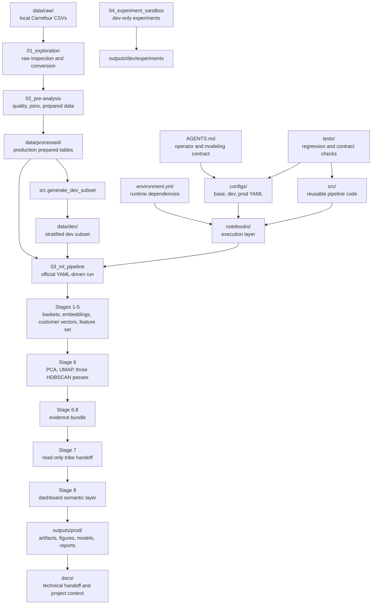
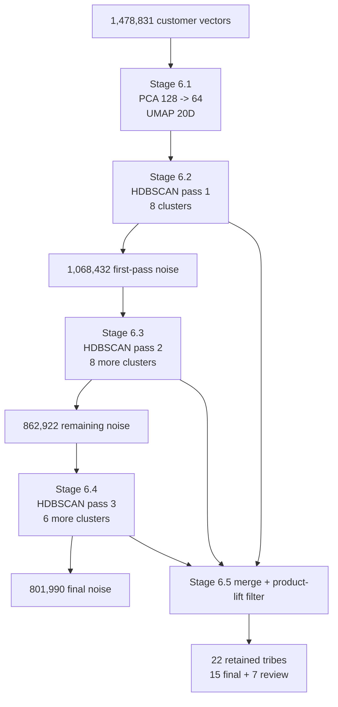

# Carrefour Data Challenge: Internal Technical Report

This document summarizes the final Carrefour customer-tribe discovery project as reflected in the current repository, notebooks, code, and `outputs/prod` artifacts. It is written for team members who have not opened the project before.

## 1. Executive Summary

The project builds a product-first behavioral segmentation of Carrefour customers from checkout transactions. The business objective is to identify actionable customer tribes based on what customers buy, how repeatedly they buy it, and how recently they bought it. The official modeling signal does not use demographics, spend, revenue tier, average basket value, or other non-product shortcuts.

The final production workflow starts from Carrefour ticket-line data, learns product embeddings from co-purchase behavior, aggregates those product embeddings into customer vectors using quantity, product IDF, recency, and product-frequency weighting, and then discovers natural customer groups with density-based clustering.

This document represents the final project version because it is anchored in the `prod` run artifacts under `outputs/prod`, especially Stage 6, Stage 7, and Stage 8. The final production artifacts show:

- 20,019,265 basket sentences created for product embedding training.
- 56,569 embedded products with 128-dimensional Item2Vec vectors.
- 1,478,831 embedded customer vectors used in the official modeling feature set.
- 22 retained hard HDBSCAN tribes after the three-pass Stage 6 discovery flow.
- 15 final promoted tribes covering 301,041 hard-cluster customers.
- 7 potential review tribes covering 375,800 hard-cluster customers.
- 801,990 customers retained as honest HDBSCAN noise, then analyzed descriptively instead of force-assigned.
- A Stage 8 dashboard-ready semantic layer whose critical readiness checks passed.

Clustering was used because the project did not start with known customer labels. The analytical goal was discovery: find natural product-behavior pockets in a very large checkout population and convert them into commercially interpretable segments.

HDBSCAN was selected as the main clustering method because it fits the project constraints better than fixed-K methods. It does not require a predetermined number of clusters, can find irregular density shapes, and can leave uncertain customers as noise. That matters here because Carrefour customers include dense specialist groups, broad generalists, bridge customers, and sparse low-signal shoppers.

A prior concept considered a simple 3-cluster segmentation, but the final solution does not use a strict 3-cluster segmentation. [Needs confirmation from notebooks/source brief: the exact location and rationale of the original 3-cluster idea is not visible in the current repository context.] The final production solution uses three hard HDBSCAN passes/configurations inside the official Stage 6 model:

1. A first pass for dense core structure.
2. A second pass over first-pass noise.
3. A third pass over customers still left as noise.

This multi-pass HDBSCAN approach produced a richer segmentation than a single fixed cluster count. It improved flexibility by recovering customer pockets at different density levels, improved stability governance by promoting only strong/usable clusters and marking weaker recovery patterns as review, and improved business interpretability by keeping only clusters with product-lift evidence while preserving honest noise.

## 2. High-Level Technical Overview

### End-to-End Workflow

The diagram shows the repository architecture, not only the modeling stages. The notebooks are the execution layer, but the logic lives in `src/`, the active settings live in `configs/`, production evidence is written under `outputs/prod/`, and the tests protect the expected behavior of those modules and configuration contracts.

### Notebook Roles

| Notebook / step | Role in the project |
|---|---|
| `notebooks/01_exploration.ipynb` | Raw data understanding, CSV-to-Parquet loading, product master review, ticket-table inspection, initial join feasibility. |
| `notebooks/02_pre-analysis.ipynb` | Data quality gates, clean joined transaction table, customer KPI profiling tables, EDA, segmentation readiness checks. |
| `python -m src.generate_dev_subset` | Builds a stratified dev subset for faster iteration. The current dev subset has 44,000 customers and 7,511,295 transaction rows. |
| `notebooks/04_experiment_sandbox.ipynb` | Optional dev-mode experimentation for embeddings, feature sets, UMAP, HDBSCAN, and model variants. Experiments are disabled in prod. |
| `notebooks/03_ml_pipeline.ipynb` | Official YAML-driven production pipeline from Stage 0 through Stage 8. Stage 0 `RUN_MODE` is authoritative for the active kernel. |

### Repository Folder Roles

| Path | Role in the project |
|---|---|
| `AGENTS.md` | Current operator and modeling-contract guide. It remains relevant because it matches the active product-first contract, dev/prod modes, Stage 6/7 rules, and artifact policies. |
| `README.md` | Practical onboarding guide for environment setup, run order, repository layout, and operating conventions. |
| `configs/` | YAML source of truth for pipeline settings. `base.yaml` holds shared settings, `dev.yaml` enables faster experimentation, and `prod.yaml` applies production-scale overrides. |
| `src/` | Reusable implementation code. It contains data loading, basket construction, Item2Vec training, customer embeddings, feature engineering, UMAP/PCA helpers, HDBSCAN orchestration, validation, profiling, visualization, Stage 8 exports, cache handling, and reporting utilities. |
| `tests/` | Unit and regression tests that protect the pipeline contract: configuration overrides, cache policy, basket diagnostics, embedding validation, customer embeddings, feature sets, official UMAP/HDBSCAN logic, Stage 6 diagnostics, profiling readiness, Stage 7/8 exports, and naming helpers. |
| `notebooks/` | Ordered execution notebooks. They call `src/` functions and write stage reports/artifacts; they should orchestrate the run rather than duplicate core logic. |
| `data/` | Local input and prepared data area. Raw CSVs, processed Parquet files, and dev subsets live here locally and are not committed except documentation/placeholders. |
| `outputs/` | Generated artifacts by mode. Production results live under `outputs/prod/`; dev experiments live under `outputs/dev/experiments/`. These include embeddings, features, models, reports, figures, Stage 6 evidence, Stage 7 handoff, and Stage 8 dashboard tables. |
| `docs/` | Human-readable project documentation, including this internal technical handoff. |
| `environment.yml` | Conda environment definition and dependency source of truth. |
| `pytest.ini` | Pytest configuration for the test suite. |
| `.gitignore` | Prevents local data, generated artifacts, models, figures, secrets, and other non-source files from being committed. |

### Main Production Stages

| Stage | What it does | Confirmed production output |
|---|---|---|
| Stage 0 | Loads prepared production data and audits mode paths. | 33 mode/path checks, 0 failures. |
| Stage 1 | Builds product-token basket sentences and audits common products. | 20,019,265 baskets, 99.963% basket retention after common-product downsampling. |
| Stage 2 | Trains Item2Vec product embeddings. | 56,569 products embedded, 128 dimensions. |
| Stage 3 | Validates product embedding neighbors and hubness. | Guardrail status `action_needed`; 2 guardrail issues. |
| Stage 4 | Aggregates product embeddings to customer embeddings. | 1,478,831 embedded customers; Stage 4 gates passed. |
| Stage 5 | Builds the official `embeddings_only` feature set. | Product-first feature set only; product-exposure challenger disabled in prod. |
| Stage 6 | Builds PCA/UMAP representation, runs three hard HDBSCAN passes, merges results, filters by product lift, checks quality/readiness. | 22 retained clusters, 54.231% noise, 45.769% core coverage. |
| Stage 6.8 | Precomputes evidence for Stage 7. | 22 tribe evidence rows, 430,466 product-lift rows, 110 sector-lift rows. |
| Stage 7 | Produces stakeholder tribe profiles, final index, review candidates, coverage, playbooks, and synthesis. | 15 promoted tribes, 7 review tribes, 22 tribe cards. |
| Stage 8 | Builds dashboard-ready relational and semantic artifacts. | Critical readiness checks passed. |

The workflow is useful for Carrefour because it converts product-level purchase behavior into segments that can be named, profiled, compared, and activated commercially without relying on demographic assumptions.

## 3. Detailed Technical Architecture

### Data Inputs

The raw expected inputs are:

- `data/raw/csv/ie_linea_ticket.csv`: ticket-line transactions.
- `data/raw/csv/ie_maestra_articulos.csv`: product/article master.

Production preprocessing writes:

- `data/processed/df_combined.parquet`: clean joined transaction/product table.
- `data/processed/customer_kpis.parquet`: customer-level spend, visit, promo, and basket metrics for profiling only.
- `data/processed/quality_report.json`: data quality gate results.

Confirmed quality-report details:

| Metric | Confirmed value |
|---|---:|
| Raw ticket rows audited | 191,017,715 |
| Rows dropped by cleaning rule | 655,196 |
| Rows retained after cleaning | 190,362,519 |
| Cleaning rule | Drop `unidades <= 0` or `importe <= 0` |
| Unique customers in quality report | 1,482,715 |
| Eligible customers at 3-ticket threshold | 1,086,761 |
| Unique products in tickets | 117,701 |
| Product-master coverage for ticket products | 100.0% |
| Months covered | January 2022 through June 2022 |

Important distinction: the quality report records the 3-ticket eligibility threshold, while the official production customer feature matrix contains 1,478,831 embedded customers. Do not describe the final Stage 6 population as only the 3-ticket-eligible subset.

### Product Embedding Architecture

Stage 1 treats each shopping basket as a product-token sentence. Products are not repeated by quantity in the active Stage 1 configuration; quantities enter later in Stage 4 customer vector aggregation.

Stage 1 also down-samples extremely common products so universal staples do not dominate product co-occurrence learning. In production, Stage 1 reported 1,429 common-product candidates, 1 auto-excluded product, and 1,428 downsampled common candidates.

Stage 2 trains Item2Vec/Word2Vec product embeddings with the promoted YAML settings:

| Setting | Production value |
|---|---:|
| Embedding dimension | 128 |
| Window | 2 |
| Full-basket context | true |
| Effective window reported | 20 |
| `min_count` | 60 |
| Negative samples | 10 |
| Sampling | 0.0001 |
| Epochs | 5 |
| Architecture | Skip-gram (`sg: 1`) |
| Embedded products | 56,569 |

Stage 3 validates product embedding quality through nearest-neighbor samples, niche/common/rare product checks, and hubness diagnostics. The production guardrail status is `action_needed`, with issues around high-inbound cross-sector hubs. That is a limitation to keep visible when interpreting product-neighbor quality.

### Customer Vector Architecture

The official customer embeddings are product-first. They aggregate product embeddings using:

- Product identity.
- `unidades`, transformed with `log1p`.
- Product IDF through `customer_embeddings.weight_strategy: quantity_idf`.
- Product-purchase recency decay.
- Product-specific customer basket-count frequency scaling.
- Normalized customer vectors.

Confirmed Stage 4 settings and diagnostics:

| Setting / metric | Value |
|---|---:|
| Weight strategy | `quantity_idf` |
| Quantity transform | `log1p` |
| Recency weighting | enabled |
| Recency reference date | 2022-06-30 |
| Recency half-life | 180 days |
| Mean recency multiplier | 0.7223 |
| Frequency weighting | enabled |
| Frequency transform | `log1p` |
| Mean frequency multiplier | 1.087 |
| Line coverage | 97.316% |
| Unit coverage | 97.711% |
| Customer coverage | 99.738% |
| Zero-embedded customers | 0.262% |
| Stage 4 gate status | pass |

`importe`, total spend, average basket value, revenue tier, and demographics are not used in the official customer vectors or official clustering feature set. Spend and KPI fields are used after clustering for interpretation, profiling, and business context.

### Feature Set and Dimensionality Reduction

Stage 5 uses `modeling.feature_set_for_selection: embeddings_only`. Behavioral features are built separately for profiling. Product-exposure challenger features are disabled in production.

Stage 6.1 reduces the official 128-dimensional customer embeddings before UMAP:

| Step | Confirmed production setting / result |
|---|---|
| PCA pre-reduction | 128 to 64 dimensions |
| Standardized before PCA | true |
| PCA retained variance | 86.858% |
| UMAP components | 20 |
| UMAP neighbors | 75 |
| UMAP metric | cosine |
| UMAP `min_dist` | 0.0 |
| UMAP rows | 1,478,831 |
| UMAP check status | pass |

UMAP is treated as a representation aid for density clustering, not as proof that a model is automatically good.

The official clustering did not reduce the customers all the way from 128 dimensions to 2 dimensions. The modeling path was `128D customer embeddings -> 64D PCA -> 20D UMAP -> HDBSCAN`. Two-dimensional views are visualization outputs only; they help humans inspect the manifold and cluster assignments, but HDBSCAN used the 20-dimensional UMAP representation for the official assignment.

### HDBSCAN Configuration

The official Stage 6 model is:

`model_e_three_stage_hdbscan_lift_core`

Its production variant is:

`three_stage_u20_n75_leaf_mcs3000_ms6_balanced_stage1_mcs3500_ms8_leaf_stage2_mcs3000_ms6_leaf_stage3_mcs2000_ms6_leaf_lift`

The three HDBSCAN passes use hard assignments only. Noise remains `tribe_id = -1`; there is no official soft assignment.

| Stage | Input population | HDBSCAN settings | Result |
|---|---:|---|---|
| Stage 6.2 first pass | 1,478,831 UMAP rows | `min_cluster_size=3500`, `min_samples=8`, `cluster_selection_method=leaf` | 8 clusters, 410,399 assigned, 1,068,432 noise. |
| Stage 6.3 second pass | First-pass noise only | `min_cluster_size=3000`, `min_samples=6`, `cluster_selection_method=leaf` | 8 additional clusters, 205,510 assigned, 862,922 still noise. |
| Stage 6.4 third pass | Remaining second-pass noise only | `min_cluster_size=2000`, `min_samples=6`, `cluster_selection_method=leaf` | 6 additional clusters, 60,932 assigned, 801,990 still noise. |
| Stage 6.5 merge | All three passes | Product-lift filter: at least 2 strong significant product lifts required | 22 retained clusters, 0 lift-rejected clusters. |

Key hyperparameters and why they mattered:

| Parameter | Confirmed value(s) | What it controls | Why it mattered here |
|---|---|---|---|
| UMAP `n_neighbors` | 75 | Size of the local neighborhood used to build the manifold. | Balanced local product-behavior structure with enough neighborhood context for a large customer population. |
| UMAP `n_components` | 20 | Dimensionality of the UMAP representation. | Kept more structure than a 2D visualization while making HDBSCAN tractable. |
| UMAP `min_dist` | 0.0 | How tightly UMAP can pack nearby points. | Encouraged compact dense regions for downstream density clustering. |
| UMAP `metric` | `cosine` | Distance measure for customer-vector similarity. | Fits normalized embedding vectors better than raw Euclidean distance. |
| HDBSCAN `min_cluster_size` | 3500, 3000, 2000 | Minimum size of a dense group. | Let the first pass find larger cores and later passes recover smaller structures from residual noise. |
| HDBSCAN `min_samples` | 8, 6, 6 | Density conservatism around core points. | Lower later-pass values made the noise passes less restrictive without force-assigning uncertain customers. |
| HDBSCAN `cluster_selection_method` | `leaf` | Whether HDBSCAN selects broad or fine-grained branches. | Supported more granular product-led tribes. |
| Product-lift filter | At least 2 strong significant product lifts | Post-clustering evidence gate. | Prevented mathematically dense but commercially vague clusters from entering the retained tribe set. |

The final merged assignment has:

- 676,841 hard-assigned customers.
- 801,990 noise customers.
- 54.231% noise.
- 45.769% core coverage.
- 0.0% soft-assigned customers.
- Average assignment confidence of 0.9264.

### Quality, Stability, and Readiness

Stage 6.5 passed the production quality gate. Stage 6.6 then assessed representation quality, cluster stability, assignment confidence, cluster size, and product-readiness.

In this project, `jitter` means a small perturbation test on customer vectors. Stage 6.6 samples hard-assigned customers, adds small random noise to their vectors, assigns the perturbed vectors to the nearest original tribe centroid, and measures how often each customer recovers its original tribe label. A tribe with `jitter_label_recovery_accuracy_mean = 0.85` keeps about 85% of sampled customers nearest to their original tribe after this small perturbation, which supports stronger readiness.

Key Stage 6 diagnostics:

| Metric | Production value | Interpretation |
|---|---:|---|
| UMAP trustworthiness | 0.9044 | Usable but below strong target. |
| UMAP mean kNN overlap | 20.36% | Usable/review range. |
| UMAP distance Spearman | 0.4517 | Weak global distance preservation. |
| HDBSCAN DBCV | -0.1715 | Weak density-validity score. |
| Core-only silhouette | 0.0996 | Weak separation by classical metric. |
| Cluster size CV | 0.8654 | Passed balance gate. |
| Jitter ARI mean | 0.3806 | Weak global perturbation stability. |
| Jitter label recovery mean | 0.5740 | Below 0.60 review threshold globally. |
| Clusters marked strong or usable | 15 | Promoted to final Stage 7 core set. |
| Clusters marked review | 7 | Retained but held out of final core tribe index. |

The final modeling decision is therefore pragmatic rather than purely metric-driven: the merged HDBSCAN assignment passes structural checks and has strong product-lift evidence for every retained tribe, but seven clusters are explicitly held for review because Stage 6.6 stability/readiness did not clear the promotion bar.

### Stage 7 and Stage 8 Handoff Architecture

Stage 6.8 is the raw-evidence boundary. It precomputes product lifts, sector lifts, co-purchase evidence, customer metric tests, remaining-customer evidence, and per-tribe customer/transaction exports.

Stage 7 is read-only. It consumes Stage 6.8 evidence and does not reopen global raw transactions or mutate assignments. Stage 7 separates final promoted tribes from potential review tribes, while still retaining review tribes in all-tribe evidence views.

Stage 8 turns Stage 6.8 and Stage 7 outputs into a dashboard-ready semantic layer. Confirmed Stage 8 readiness checks passed for input availability, output existence, customer coverage reconciliation, promoted/review counts, product evidence, deep dives, promoted-tribe action rows, embedding validity, and relational integrity.

## 4. Results and Interpretation

### Final Promoted Tribes

The final promoted set contains 15 tribes and 301,041 hard-cluster customers. `population_share_pct` below is normalized over promoted final tribes. `assigned_population_share_pct` uses the full 676,841 hard-assigned profile denominator before review tribes are held out.

| Order | Tribe ID | Final tribe | Readiness | Customers | Promoted share | Assigned share | Primary theme |
|---:|---:|---|---|---:|---:|---:|---|
| 1 | 6 | Chirimoya Merca Buyers | usable | 48,465 | 16.10% | 7.16% | Bakery & Breakfast Buyers |
| 2 | 2 | Aceite Corporal Natural Buyers | usable | 35,321 | 11.73% | 5.22% | Personal Care Buyers |
| 3 | 12 | Ginebra Beefeater Buyers | usable | 28,225 | 9.38% | 4.17% | Beer & Alcohol Buyers |
| 4 | 10 | Coffee & Tea Buyers | strong | 26,325 | 8.74% | 3.89% | Coffee & Tea Buyers |
| 5 | 3 | Set Piezas Cuberteria Buyers | strong | 26,297 | 8.74% | 3.89% | Home & Kitchen Buyers |
| 6 | 0 | Purina Gourmet Perle Buyers | usable | 24,245 | 8.05% | 3.58% | Seafood Buyers |
| 7 | 1 | Desayuno Empleado Especial Buyers | usable | 23,060 | 7.66% | 3.41% | Fresh Produce Buyers |
| 8 | 19 | Butifarra Catalana Exentis Buyers | usable | 16,300 | 5.41% | 2.41% | Fresh Meat Buyers |
| 9 | 8 | Gluten-Free Buyers | strong | 15,580 | 5.18% | 2.30% | Gluten-Free Buyers |
| 10 | 20 | Cerveza Especial Carrefour Buyers | strong | 12,656 | 4.20% | 1.87% | Beer & Alcohol Buyers |
| 11 | 14 | Mikado Familiar Chocoleche Buyers | strong | 10,921 | 3.63% | 1.61% | Bakery & Breakfast Buyers |
| 12 | 11 | Chorizo Aperitivo Skin Buyers | usable | 9,670 | 3.21% | 1.43% | Fresh Meat Buyers |
| 13 | 21 | Tang 30G Buyers | usable | 9,599 | 3.19% | 1.42% | Fresh Meat Buyers |
| 14 | 16 | Pack Ahorro Lentejas Buyers | strong | 7,700 | 2.56% | 1.14% | Frozen & Ice Cream Buyers |
| 15 | 17 | Cereales Integrales Nesquik Buyers | usable | 6,677 | 2.22% | 0.99% | Fresh Meat Buyers |

The final segmentation is more granular than three clusters. It separates alcohol, coffee, personal care, pet/seafood-associated behavior, gluten-free, home/kitchen, frozen/ice-cream, fresh meat, fresh produce, and bakery/breakfast patterns into distinct customer groups.

### Potential Review Tribes

The seven review tribes remain visible as potential behavioral pockets but are held out of the final promoted core index.

| Tribe ID | Potential review tribe | Customers | Assigned share | Review reason |
|---:|---|---:|---:|---|
| 4 | Mini Rigatoni Con Buyers | 73,534 | 10.864% | Stage 6 readiness review / statistical validity review. |
| 5 | Chocolate Amargo Luker Buyers | 62,179 | 9.187% | Stage 6 readiness review / statistical validity review. |
| 7 | Patata Bio Granel Buyers | 117,298 | 17.330% | Stage 6 readiness review / statistical validity review. |
| 9 | Camiseta Manga Larga Buyers | 62,911 | 9.295% | Stage 6 readiness review / statistical validity review. |
| 13 | Huevos Zurron Suelo Buyers | 30,600 | 4.521% | Stage 6 readiness review / statistical validity review. |
| 15 | Chocolate Negro Cacao Buyers | 21,278 | 3.144% | Stage 6 readiness review / statistical validity review. |
| 18 | Gallo Mediano Buyers | 8,000 | 1.182% | Stage 6 readiness review / statistical validity review. |

### Remaining Customers

The final model deliberately leaves 801,990 customers as HDBSCAN noise. Stage 6.7 and Stage 7 do not hide these customers; they describe them as non-core customer groups:

| Remaining segment | Customers | Share of total | Interpretation |
|---|---:|---:|---|
| Bridge customers between tribes | 341,589 | 23.099% | Affinity split across multiple tribes; not appropriate for exclusive tribe messaging. |
| Sparse or low-signal shoppers | 155,026 | 10.483% | Too little behavioral evidence for stable hard clustering. |
| Near-tribe fringe customers | 120,910 | 8.176% | Close to one tribe but outside dense HDBSCAN regions. |
| Broad generalist shoppers | 95,141 | 6.434% | Wide baskets dilute product-lift and density signals. |
| Unclear long-tail customers | 54,155 | 3.662% | Heterogeneous behavior remains after hard clustering. |
| High-value broad-basket customers | 35,169 | 2.378% | High spend and broad product coverage, better handled through lifecycle/value strategies. |

This is important commercially: the final segmentation is not claiming every customer belongs to a precise tribe. It offers final tribes where the evidence is strong or usable, review candidates where the signal exists but needs caution, and descriptive strategies for customers who do not belong to a dense product-behavior group.

### Business Use

The final tribes are useful because each retained group is backed by product-lift evidence and can be translated into category, merchandising, and activation ideas. Examples include:

- Category-led campaigns for Coffee & Tea Buyers, Gluten-Free Buyers, Beer & Alcohol Buyers, Fresh Meat Buyers, and Frozen & Ice Cream Buyers.
- Product-affinity and cross-sell plays using distinctive lifted products and co-purchase missions.
- Store and lifecycle strategies for broad-basket and bridge customers where hard tribe targeting would be too narrow.
- Review-tribe experimentation for large but less stable pockets, with clear caveats before broad business adoption.

The results are credible because the production run preserves uncertainty instead of forcing all customers into clusters, separates final and review tribes, reports quality/stability diagnostics, and validates business interpretability with product-lift evidence rather than cluster metrics alone.

## 5. Visuals and Charts

### HDBSCAN Discovery Summary

### Key Production Figures

The following existing output figures are the most useful visuals for explaining the final production run:

| Figure | Purpose |
|---|---|
| `../outputs/prod/figures/stage6_1_umap_representation.png` | Shows the UMAP customer manifold before clustering. |
| `../outputs/prod/figures/stage6_5_merged_three_stage_hdbscan_assignment_map.png` | Shows the merged three-stage HDBSCAN hard assignments. |
| `../outputs/prod/figures/stage6_6_quality_evidence.png` | Summarizes representation and density evidence. |
| `../outputs/prod/figures/stage6_6_cluster_readiness.png` | Shows Stage 6.6 cluster readiness. |
| `../outputs/prod/figures/stage_07_all_tribe_behavior_metric_heatmap_prod.png` | Compares tribe behavioral metrics after clustering. |
| `../outputs/prod/figures/stage_07_all_tribe_product_theme_lift_heatmap_prod.png` | Shows product-theme lift patterns across tribes. |
| `../outputs/prod/figures/stage_07_customer_coverage_prod.png` | Shows final, review, remaining, and soft-audience coverage. |

### Important Limitations and Notes

- Stage 3 product embedding validation ended with `action_needed` because hubness diagnostics found high-inbound cross-sector hubs.
- Stage 6 classical separation metrics are weak: DBCV is negative and silhouette is low. The final decision relies on a combination of hard density structure, product-lift evidence, assignment confidence, readiness labels, and business interpretability.
- 54.231% of embedded customers remain HDBSCAN noise. This is intentional in the official flow; do not silently soft-assign them.
- Seven retained clusters are `potential_review`, not final core tribes.
- Several final names are SKU-fallback names. Business naming may be improved, but any renaming should preserve the product evidence and readiness caveats.
- The final manifest reports `llm_enabled: false`; optional LLM interpretation is not part of the official clustering or promotion decision.
- Raw data, generated Parquet files, model binaries, and output figures are local artifacts and should not be committed.
